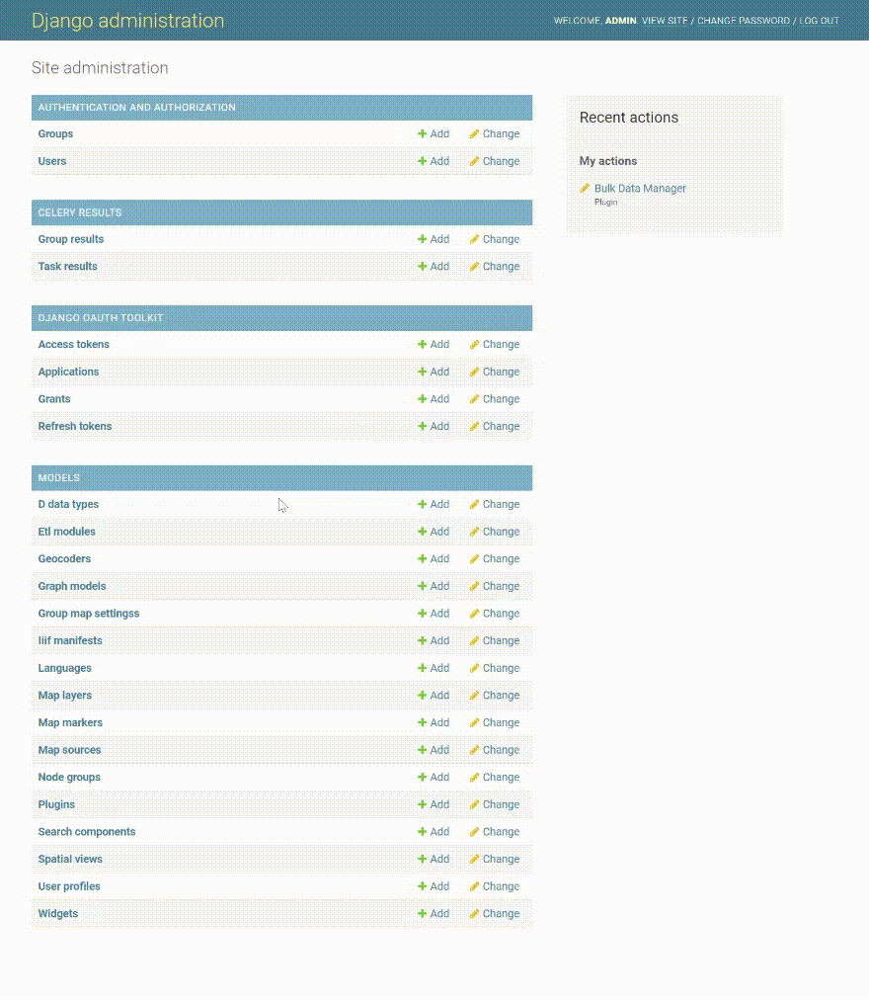
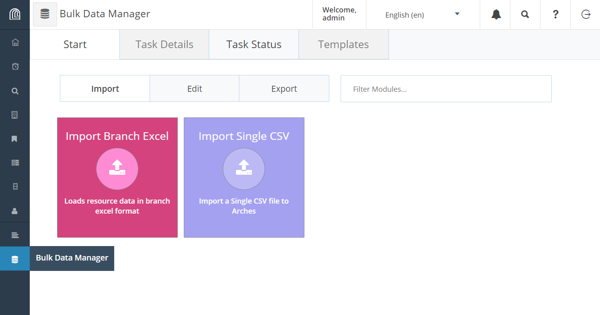
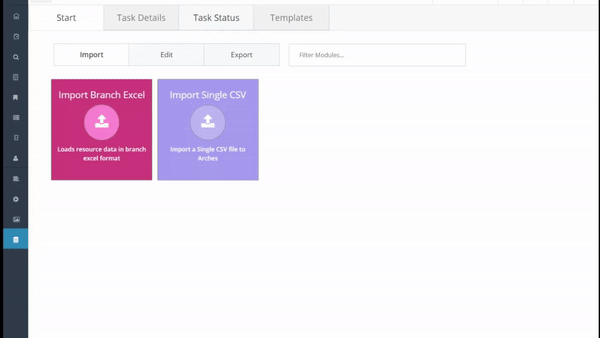
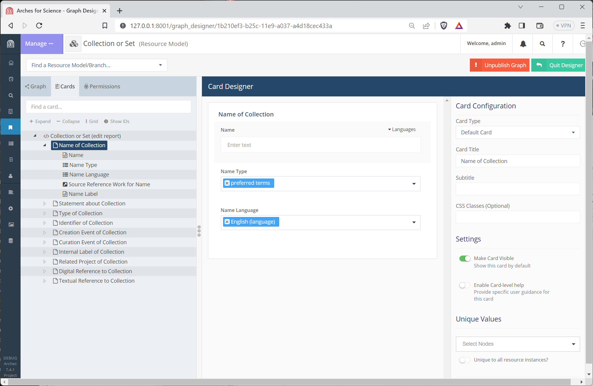
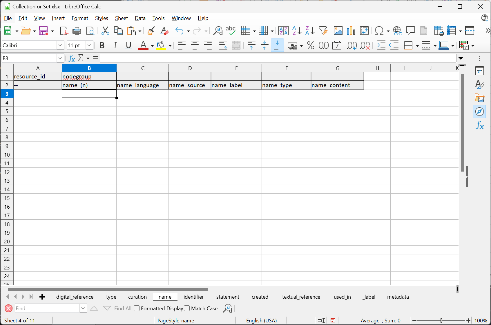
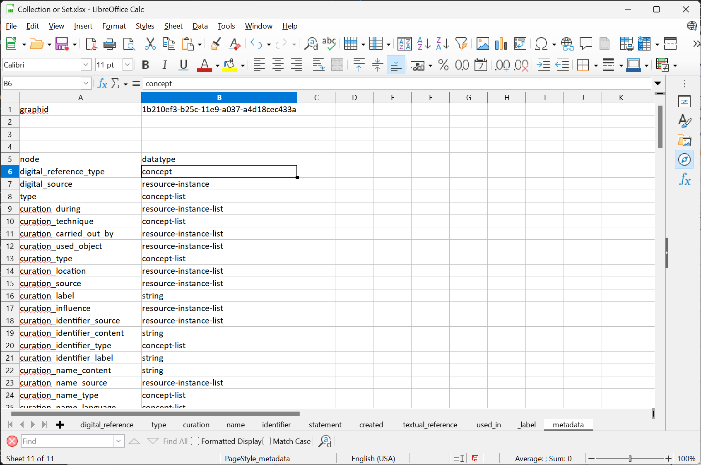
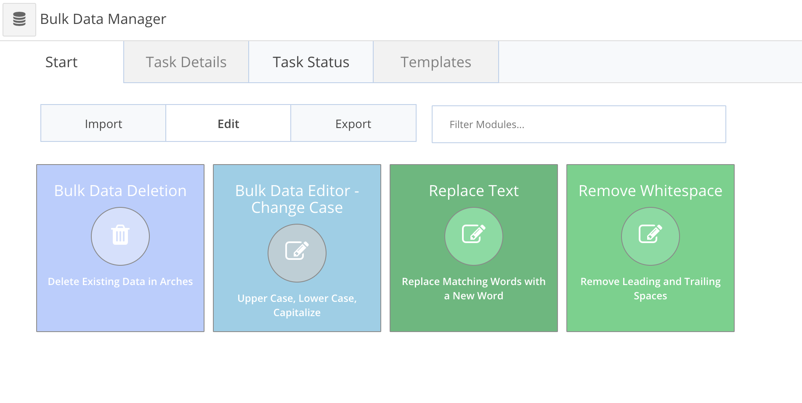
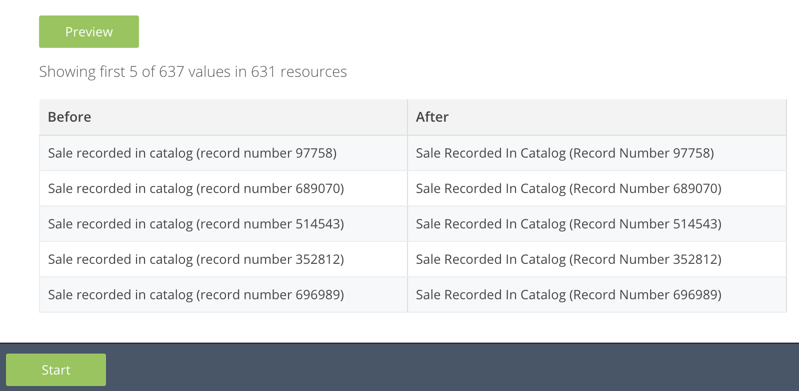
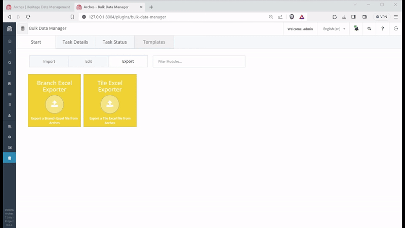
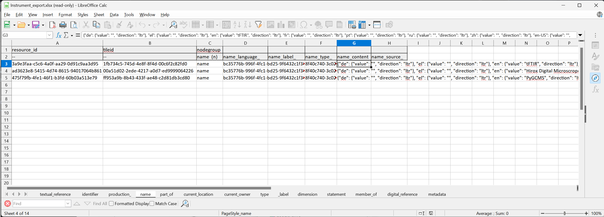

#################
Bulk Data Manager
#################

As of version 7.4, Arches provides **Bulk Data Manager** user interface tools for administrators to import and update large sets of data "in bulk". These allow administrators to make changes across large sets of data, not just record by record.

----------------------------
Enable the Bulk Data Manager
----------------------------
The Bulk Data Manager is an Arches plugin (see :ref:`Plugins`). This plugin will be installed when you install Arches, but, by default, the Bulk Data Manager will be hidden.

To enable use of the Bulk Data Manager, login to the :ref:`Django Admin User Interface <django admin user interface>` and click the link to "Plugins" under models, click the "Bulk Data Manager", and edit the JSON value for the attribute "Config". To use the Bulk Data Manager, you will also need to enable Task Management (see :ref:`Task Management` and :ref:`Setting up Supervisord for Celery`).

To enable use of the Bulk Data Manager the Config should be: ``{"show": true}``. To disable use of the Bulk Data Manager, the Config should be: ``{"show": false}``. Once you've made your change, press the "Save" button in the lower right.

The image below illustrates how to enable the Bulk Data Manager:

    Enable the Bulk Data Manager via the Django Admin panel.

.. note:: The Bulk Data Manager requires that you have properly installed and configured :ref:`Task Management` with Celery.

----------------------------
Using the Bulk Data Manager
----------------------------
Once you've enabled the Bulk Data Manager, Arches administrators will have access to Import, Edit, and Export functionality.

    Arches Bulk Data Manager plugin.

Import
======
The Bulk Data Manager has several **Import** related features to support the configuration and ingest of tabular organized data into Arches. These features presume familiarity with both the core Arches :ref:`Data Model` and the specific resource models and branches (see :ref:`Designing the Database`) used in your instance.

The Bulk Data Manager import tools support imports of data stored in CSV and Excel files. The CSV and Excel importers require that data in tables (and in the case of Excel, worksheets) will be organized according to map properly to your resource models and node structures for these resource models. To assist in creating data properly structured for successful import, you can download an Excel workbook template for a given resource model. The animation below illustrates how to export a template for an example resource model.

    Bulk Data Manager export of an Excel template for the (example) "Collection or Set" resource model

To describe how to use the Bulk Data Manager to import data, we'll refer to the `Arches for Science <https://www.archesproject.org/arches-for-science/>`_ project *Collection or Set* resource model as an illustrative example. In the :ref:`Arches Designer`, the card for the *Name of Collection* branch of the *Collection or Set* resource model looks like this:

    Arches Designer view of the *Name of Collection* card used in the *Collection or Set* resource model

If you used the Bulk Data Manager to download an Excel template file for this *Collection or Set* resource model, you would see worksheets for each branch used with the resource model. The *Name of Collection* branch of the *Collection or Set* resource model has shaded nodegroups and nodes that looks like this:

    Excel template worksheet for *Collection or Set* resource model *Name of Collection* branch nodegroups and nodes.

The Excel template file also includes a worksheet called "metadata". The metadata worksheet describes the datatypes (see more: :ref:`Core Arches Datatypes`) expected by each node:

    Excel template *metadata* worksheet for datatypes used by *Collection or Set* branch nodes.

.. note::
    **Bulk Uploading Files**
    If you want to import resource instances that include datatype "file-list" nodes, then the files associated with those nodes will need to be imported along with the Excel workbook. To do this, zip compress a folder that includes the Excel workbook to be imported along with the associated files (such as image files) named in the "file-list" nodes. The files (such as image files) should be in the same folder as the Excel workbook (or the import CSV). The zip file should be named the same as the Excel workbook(or the import CSV). The Bulk Data Manager will recognize the zip file and import the files along with the Excel workbook (or the import CSV). A valid zip file structure would look like this:

    .. code-block:: bash

        my_import.zip
        ├── my_import.csv
        ├── image1.jpg
        ├── image2.jpg
        ├── image3.jpg
        └── image4.jpg

Edit
====

The **Edit** tab of the Bulk Data Manager enables Arches administrators to make mass edits of string data across many resource instances.
As of version 7.5.0, the current string editing options include:

1. Bulk Deletion
2. Change case (uppercase, lowercase, capitalize)
3. Replace Text
4. Remove Whitespace

Editing operations require all or some of the following options:

1. Seach URL (optional) - Defines the bounds of what resources can be edited.  Actual edited resources could be less then what the search defines (see below).
2. Resource Model - Resource instances of the model to edit
3. Node - The node value in each resource instance to edit
4. Nodegroup - (Deletion only) the tile associated with the nodegroup to delete
5. Language - The language to update in each node
6. From and To - (Replace Text only) the text you would like to search and replace

**Search URL details**
    Copy and paste a URL of a search that retrieves a set of resource instances that you want to limit your bulk edit operation to.
    This does not mean that those resources will actually be edited, only that resources that don't fall within that search result won't be edited.

    For example, in a capitalize operation:
        - If a search URL returns 3 records but one of them is already capitalized then only the remaining 2 uncapitalized records will be updated.
        - If a search URL returns 3 records but the node in the model contains more then 3 records that are uncapitalized, then only the 3 records defined in your search will be updated.

**Preview button**
    Once you're satisfied with the options you've selected click the preview button to preview a
    small set of records that match your criteria to see the before and after of the edit operation.

**Start button**
    Click the start button if you'd like to actually kick off the edit operation.  You will be taken to the Task Status tab.
    Depending on the operation selected and the number of resources being edited, this can take some time.
    Edit operations are placed into a work queue and at this point you can leave this page.  The Task Status
    will update itself every 5 seconds (there is no need to refresh the page).

Export
======
The **Export** tab of the Bulk Data Manager enables Arches administrators to make mass exports of resource instance data. The exported data will be in Excel workbooks. You choose to export data expressed in either a "Branch" or a "Tile" structure.

    Export of a resource instance data into an Excel workbook with the Branch structure

If you have resource instances that include datatype "file-list" nodes, then the files associated with those nodes will be exported into a zip file.

The Tile and Branch data export will export data in exactly the same formats used with the corresponding Bulk Data manager importers. This means that you can use the Bulk Data Manager to export data, make edits to the exported data, and then re-import the edited data. This can be useful for making mass edits to data that is not easily edited in the Arches user interface. The data made a available through the Export tools will also provide invaluable examples of how to express data in a manner suitable for import.

    Example "Branch" Excel export of resource instance data

Deleting Stuck Tasks
====================
The **Bulk Data Manager** uses worker processes (see :ref:`Task Management`) to perform operations on the database. Occasionally, an operation may fail and reult in a stuck task. If you have a task that is stuck and you want to delete it, you can do so via SQL operations on the database. The relevant tables relating to tasks are ``load_event`` and ``load_staging``. Here is an example of how delete a record in the ``load_event`` table:

.. code-block:: sql

    -- Verify the load_event of interest exists
    SELECT * FROM load_event WHERE loadid = 'some-load-event-uuid';

Once you've verified the record exists, and this is a record you do want to delete, you can delete it with the following SQL:

.. code-block:: sql

    -- Now delete the load_event record
    DELETE FROM load_event WHERE loadid = 'some-load-event-uuid';

This may not immediately cause tasks to be removed from the **Bulk Data Manager** queue in the web UI, but it should clear stuck tasks.