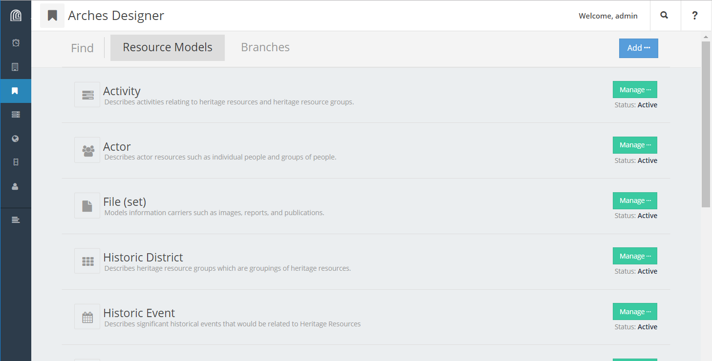
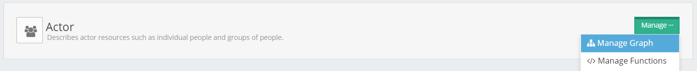
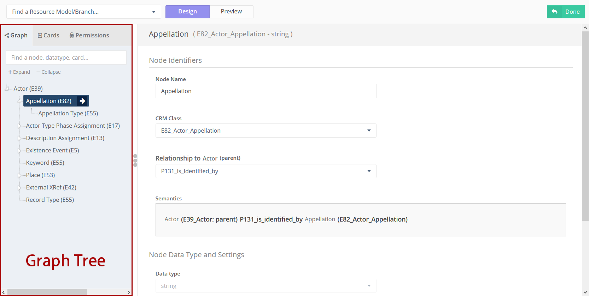
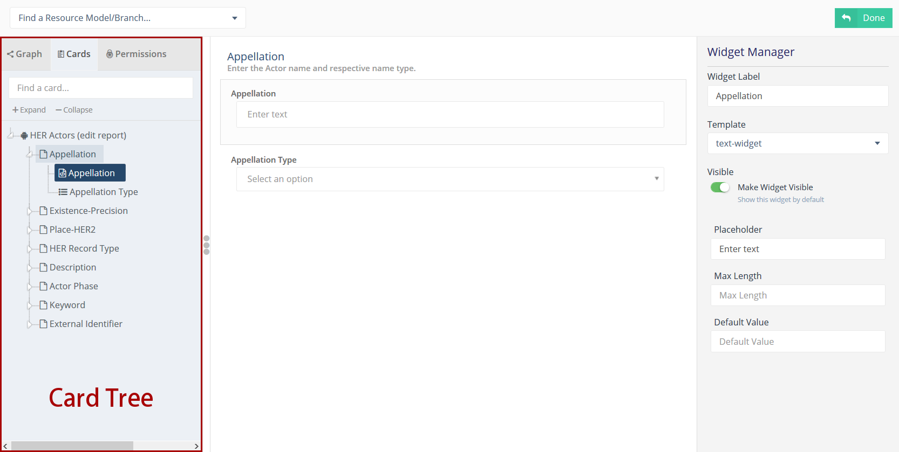
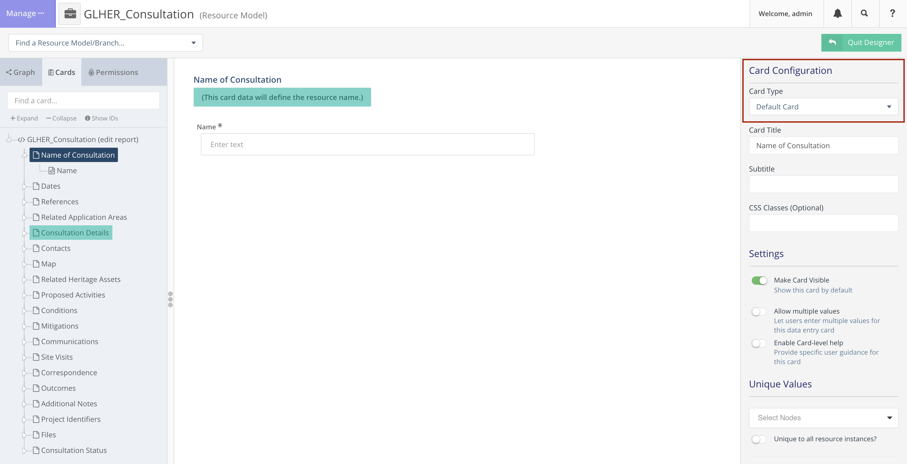
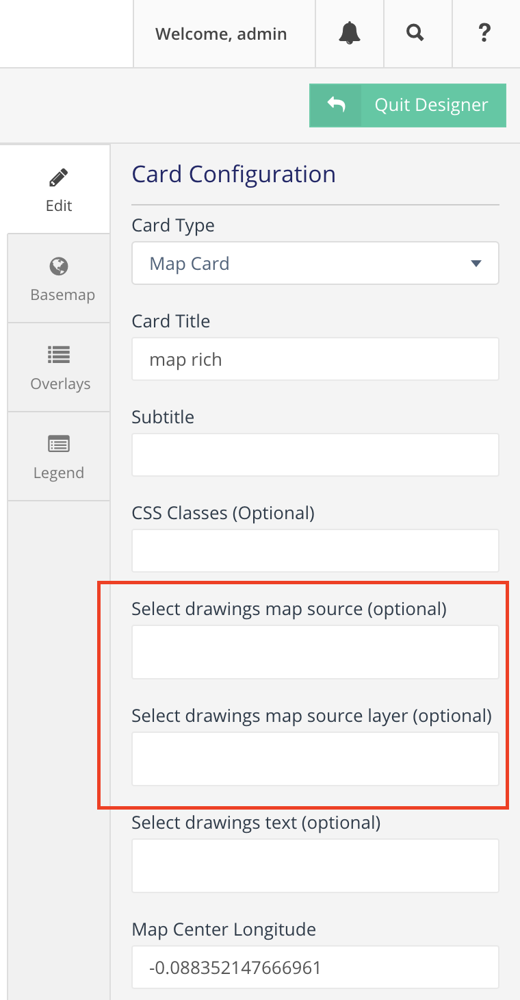
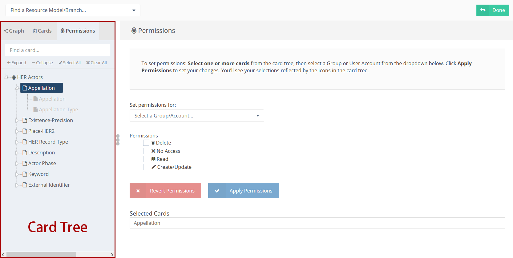

######################
Designing the Database
######################

Arches Database Theory
======================

Let's begin with a brief primer on some of the core concepts upon which Arches is constructed.

**Resources** - Resources are what we call database records. If you are using Arches to create an inventory of historic buildings, each one of those buildings will be recorded as a "resource". This terminology is used throughout the app.

**Resource Models** - When creating new Resources, a data entry user must decide which Resource Model to use, determining what information is collected for the Resource. Think of different Resource Models as categories of records in your database -- "Buildings" vs. "Archaeological Sites" vs. "Cemeteries", for example. Every Arches database must have at least one Resource Model.

**Branches** - Branches are tools for transport of complex node structures from one Resource Model to another. This allows you to avoid manually recreating the same "branches" in multiple Resource Models.

.. note:: Both **Resource Models** and **Branches** are sometimes referred to generically as "graphs". This is because their underlying architecture is a graph. However, as you'll see, they play completely different roles in Arches.

.. important:: The Arches Designer is used for altering the record-keeping structure of your database; it does not alter the physical :ref:`data model`.

.. warning:: If you need to have multiple versions of the same graph, perhaps multiple people are designing it or you need to retain earlier iterations while continuing to add nodes, you must Clone the graph. If a graph is renamed, exported, and imported, it will still overwrite the original, because the unique ID will remain unchanged.

Graph Versioning (Arches 8+)
============================

Starting with Arches 8, Resource Models and Branches support versioning through a draft/published workflow. This allows for safer and more controlled updates to your database structure.

Version States
--------------

Each graph (Resource Model or Branch) can exist in two states:

**Draft Version**
   - This is where you can make unpublished changes to the graph structure. When working in draft mode, you can:
   - Modify the graph structure (add/remove nodegroups, nodes, etc.)
   - Update card configurations
   - Change widget settings

**Published Version**
   - This is the active version of the graph for use with resource instances. In the published state:
   - The graph structure is locked
   - You can still modify UI-related elements (card labels, widget labels, etc.)
   - If you later descide to make a new version of the graph, existing resource instances using a prior version will become read-only

Making Changes
--------------

There are two types of changes you can make to graphs:

1. **Additive Changes** \- Adding new nodegroups or nodes to a graph. These changes are handled automatically by Arches and don't require special data migrations.

2. **Structural Changes** \- Any changes that modify existing nodes, relationships, or data structures. These require:
   - Creating a new draft version
   - Making the changes in the draft
   - Publishing the new version
   - Writing Django migrations to update existing resources to the new version

.. important:: 
   - When a new version of a graph is published, resources created with the old version become read-only
   - Resource instances using old versions of a graph remain searchable and indexable
   - UI-related changes (labels, tooltips, etc.) can be made to published graphs without creating a new graph version
   - For structural changes, you'll need someone with Django expertise to write database migrations to update existing resources

Arches Designer
===============

The Arches Designer is where you export, import, duplicate, modify, and create your Resource Models and Branches. Any user who is part of the Graph Editor group will have access to the Arches Designer.

If you don't see any Resource Models listed in your Arches Designer, you may want to consider :ref:`loading a package <loading a package into a project>`. Alternatively, you can directly import individual Resource Model files through **Add ...**.

To edit a Resource Model, click on it or click **Manage ...** > **Manage Graph** and you'll be brought to the Graph Designer.

Graph Designer
==============

Almost all aspects of Resource Model and Branch design are handled in the Graph Designer. The exception is Functions, which are handled in the separate Function Manager.

The Graph Designer comprises three tabs, the `Graph Tab`_, `Cards Tab`_, and `Permissions Tab`_ (the Permissions Tab is available after you click the "Make changes without publishing" option). Each tab is used to configure a different aspect of the Resource Model: In the Graph Tab you design the node structure, in the Cards Tab you configure the user interface (card) for each nodegroup, and in the Permissions Tab you are able to assign detailed permission levels to each card. The general workflow for using the Graph Designer is to proceed through the tabs in that same order.

Graph Tab
---------

The Graph Tab is where you build the actual graph, a structured set of nodes and nodegroups, which is the core of a Resource Model or Branch. As noted above, sometimes Resource Models and Branches are generically referred to as "graphs", and this may seem confusing at first, but you'll come to see that it is an appropriate nickname.

   Screenshot of the Graph Tab in the Graph Designer, showing an "Actor" Resource Model.

In practice, constructing the graph means adding nodes (or existing Branches) to the Graph Tree, which appears on the left side of the page when the Graph Tab is activated. When you add a new node, you set many different settings for that node, like datatype, in the main panel of the page.

During the graph construction process, you are able to create a new Branch from any portion of your graph. This is useful if you have completed a large section of the graph, and want to reuse it later in another Resource Model.

.. note:: If you are building a graph that uses an ontology, the ontology rules will automatically be enforced during this graph construction process.

Core Arches Datatypes
---------------------

Nodes in Arches must be configured with a "Data Type", and different datatypes store different kinds of information. For example, a **string** datatype is what you should use to store arbitrary text, like the name or description of a resource. A brief description of all datatype options in core Arches follows. Developers can extend Arches by :ref:`creating their own custom datatypes <datatypes>`.

:semantic: A semantic node **does not store data**. Semantic nodes are used where necessary to make symbolic connections between other nodes, generally in order to follow ontological rules. The top node of every graph is a semantic node.
:string: Stores a localized string of text. This could be something simple like a name, or more something elaborate like a descriptive paragraph with formatting and hyperlinks.
:non-localized-string: Stores a string of text without localization. Use this for text that is equal across all languages such as an identifier or an address.
:number: Stores a number.
:file-list: Stores one or mores files. Use this to upload images, documents, etc.
:concept: Stores one of a series of concepts from the Reference Data Manager. Users will choose a concept in a dropdown list or set of radio buttons. You'll further be prompted to choose a Concept Collection—this controls which concepts the user is able to choose from.
:concept-list: Stores multiple concepts in a single node.
:geojson-feature-collection: Stores location information. Use this for a node that should be displayed as an overlay on the main search map.
:domain-value: Similar to "concept", choose this to present the user with a dropdown list or set of radio buttons. Unlike "concept" this dropdown menu will not come from your system-wide controlled vocubulary, but from a list of values that you must define here.
:domain-value-list: Stores multiple domain-values in a single node.
:date: Stores a CE calendar date. See etdf for BCE and fuzzy date handling.
:node-value: Stores a reference to a different node in this graph. This would allow you to store duplicate data in more than one branch.
:boolean: Use this to store a "yes"/"no" or "true"/"false" value.
:edtf: Stores an Extended Date/Time Format value. Use this data type for BCE dates or dates with uncertainty. This datatype requires extra configuration to inform the database search methods how to interpret EDTF values. Data entry users can enter edtf dates using formats listed in the EDTF draft specification.
:annotation:  Used to store an IIIF annotation.
:url: Stores a web address.
:resource-instance: Embeds a separate resource instance into this node. For example, you could add a node called "Assessed By" to a condition assessment branch, and use this data type. This would allow you to associate an individual stored in your database as an Actor resource with a specific condition assessment. Note that this construction is different from making a "resource-to-resource relationship".
:resource-instance-list: Stores a list of resource instances in a single node.

Cards Tab
---------

Once you have added nodes to the graph, you can switch to the Cards Tab to begin refining the user interface. As you can see, the graph tree is replaced with a "card tree", which is very similar to what users will see when they begin creating a resource using this Resource Model.

   Screenshot of the Cards Tab in the Graph Designer, showing an "Actor" Resource Model.

The top of the card tree is the root of the Resource Model, and you'll select it to configure the public-facing resource report. Below this, you'll see a list of cards in the Resource Model, some of which may be nested within others. There will be a card in the card tree for every nodegroup in the graph tree. Finally, within each card you'll see one or more widgets. These correspond to nodes in the graph that collect business data. In the image above, the Appellation widget is selected.

When you select a card or a widget, you will see the Card Manager or Widget Manager appear on the right-hand side of the page. This is where you will update settings like labels, placeholder text, tooltips, etc. The middle of the page shows a preview of how a data entry user will experience the card.

.. tip:: While working with the Cards Tab, you may need to go back and change a node in the Graph Tab. Be aware that though you may expect node changes in the Graph Tab to cascade to widget configurations in the Cards Tab, this does not always happen. Be sure to double-check your work!

Card Types
----------

The UI of a card can be configured using a card component. Note that when you click a node in the card tree, the "Card Configuration" panel on the right-hand side of the screen will show the card component in a dropdown called "Card Type".

    Screenshot of the card manager user interface, highlighting "Card Type" dropdown in the top-right corner.

The "CSS Classes" input box enables a user to enter space-separated class names (e.g. ``card-empty-class card-incomplete-class``) that correspond to class names defined by a developer in ``package.css``.

While card components can be created from scratch, Arches (v5 on) comes with a few out of the box:

Grouping Card
^^^^^^^^^^^^^
The **Grouping Card** groups multiple cards into a single user interface (UI). One card acts as the root of the group by changing its "Card Type" to "Grouping Card" and then assigning "sibling" cards to it (in the last field of the Card Configuration section). While arches makes it easy to edit an existing card to include other nodes, the grouping card might be useful for cases where resource instances already exist for a model thus preventing you from editing the cards but you still want to group different cards together.

Map Card
^^^^^^^^
The **Map Card** enables more customization for nodes of type ``geojson-collection``. It has optional settings to start the map at a specific LatLng center and default zoom level. It can also import a particular map source layer of data into the UI. This might be useful if the user entering new geometry would benefit from having other resource data for reference in the map. To add a `map source
<https://docs.mapbox.com/mapbox-gl-js/style-spec/#sources>`_
or `source_layer
<https://docs.mapbox.com/mapbox-gl-js/style-spec/#layer-source-layer>`_ simply type its name (no quotes).

   Screenshot of card configuration panel, highlighting the fields: "Select drawings map source" and "Select drawings map source layer".

Related Resources Map Card
^^^^^^^^^^^^^^^^^^^^^^^^^^
The **Related Resources Map Card** enables a more rich user experience for nodes of type ``related-resource``. Like the Map Card, map layer data representing resources can be added to a map UI such that the user can navigate geographically to select a related resource instead of paging through the dropdown list of relatable resources (however the dropdown still works normally in this card component). This card component is very useful if a user knows the geographic context of a resource (like what neighborhood it's in) instead of its name. The steps to add such map data are the same as in the Map Card configuration panel.

.. figure:: ../images/related_resources_mapcard.png

   Screenshot of a card using related resources map card, showing a selected resource in the map, polygon outlined in purple to show selection, and the resource instance's name selected in the dropdown widget to the right of the map.

Permissions Tab
---------------

Arches allows you to define permissions at the card level. Because of publication changes to Graphs in version 8, the `Permissions Tab` has been moved from its location in earlier versions of Arches. To access permissions, click the button "Make changes without publishing" (see the animation below). Note, you will only be able to select entire cards, not individual nodes.

.. figure:: ../images/arches-ui-permissions-v8.gif

   Animation showing the activation of the Permissions Tab in the Graph Designer.

Below, you can see a screenshot of the Permissions Tab in the Graph Designer for Arches version 7 and earlier. Note that the interface has changed in version 8, but the functionality is the same.

   Screenshot of the Version 7 (and earlier) Permissions Tab in the Graph Designer.

Once you have selected one or more cards, you can select a user or user group and then assign one of the following permissions levels:

:Delete: Allows users to delete instances of this nodegroup. Note, this is not the same as being allowed to delete an entire resource, permissions for which are not handled here.
:No Access: Disallows users from seeing or editing instances of this nodegroup. Use this permission level to hide sensitive data from non-authenticated users (the public).
:Read: Allows users to see this nodegroup's card. If disallowed, the card/nodegroup will be hidden from the map and resource reports.
:Create/Update: Allows users to create or edit instances of this nodegroup. This provides the ability to let users edit some information about a resource, while be restricted from editing other information.
