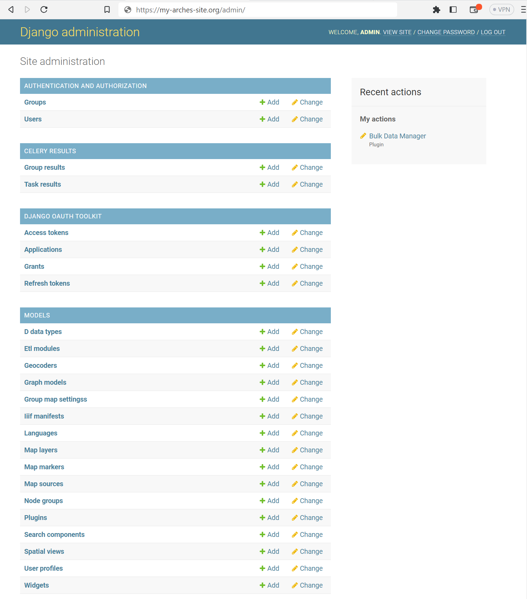

###########################
Django Admin User Interface
###########################

Arches is built with the Django framework `Django Documentation <https://docs.djangoproject.com/>`_ and Arches makes use of the administrative user interface utilities that come standard with Django applications. The Django admin tools are intended for use by an organization's trusted internal management team. It's not intended for wider use by end users.

Arches administrators can use the the Django admin interface to control permissions for individual users and groups of users (see :ref:`Managing Permissions`) as well as certain site configurations and customizations (especially customizations for map interfaces).

.. note::
  You can access the Django admin at ``localhost:8000/admin``, the default admin credentials are ``admin/admin``,
  which must be changed in production. In production, the URL to the Django admin interface will be ``https://my-arches-site.org/admin/`` **Any user with "staff" status can access the Django admin panel.**

Once logged into the admin panel, you'll see a page similar to this:

    Arches site administration in Django admin panel.
