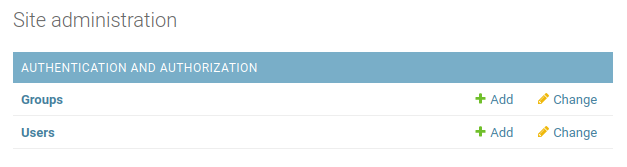
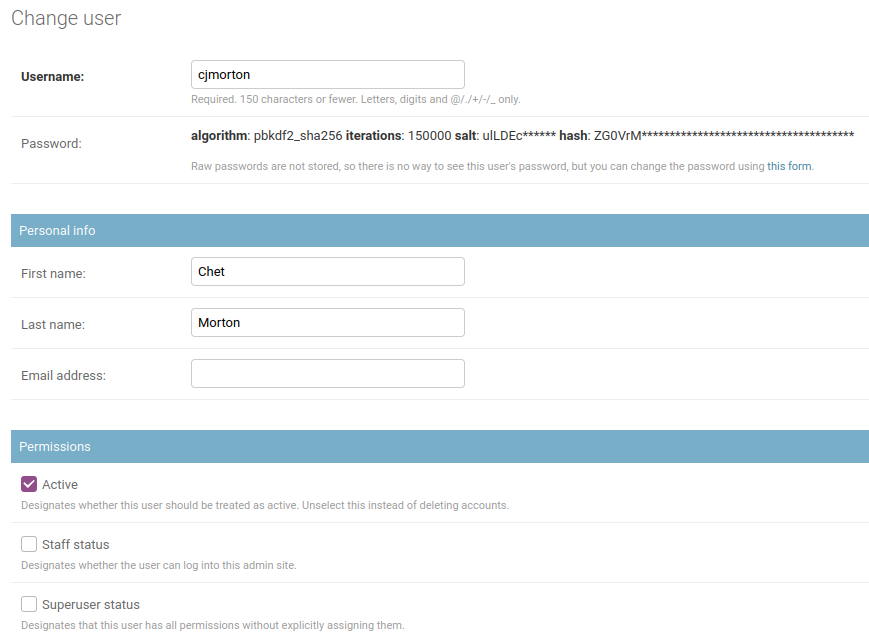
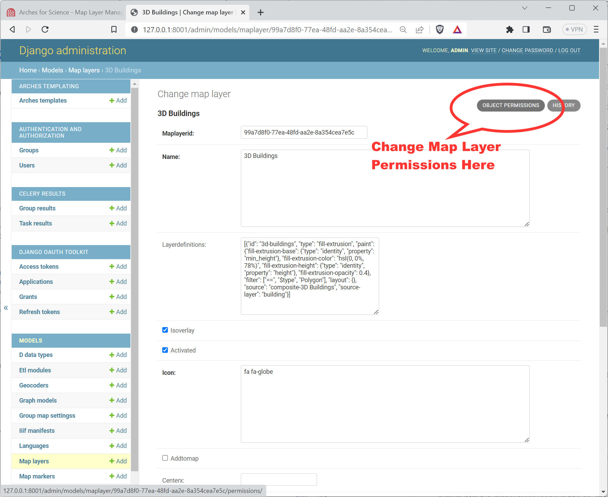
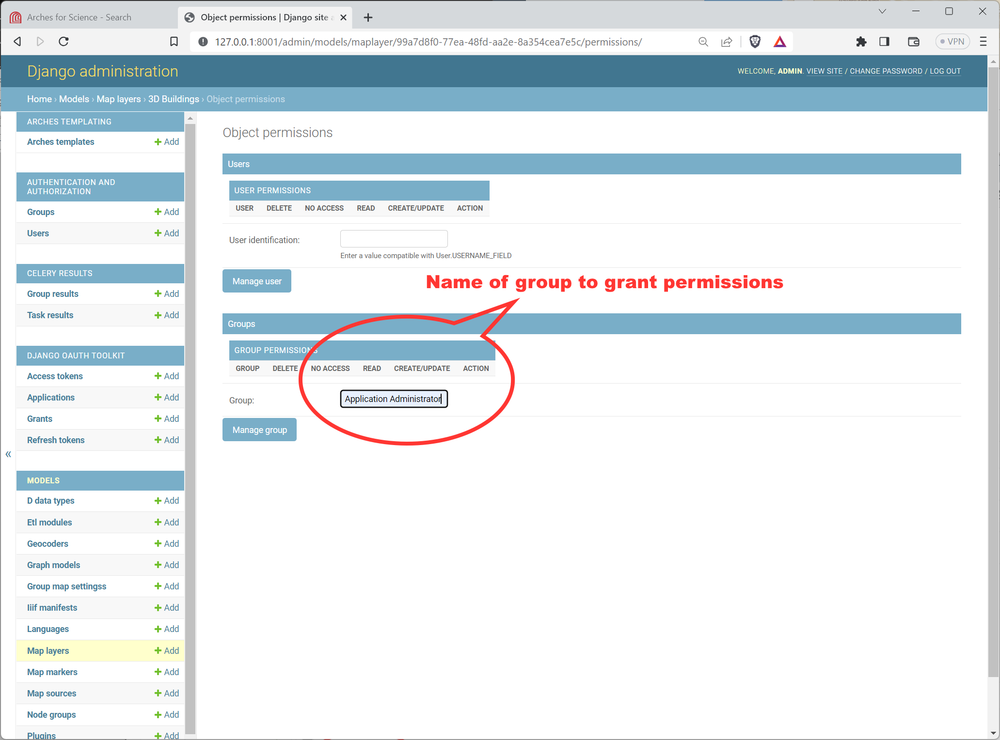
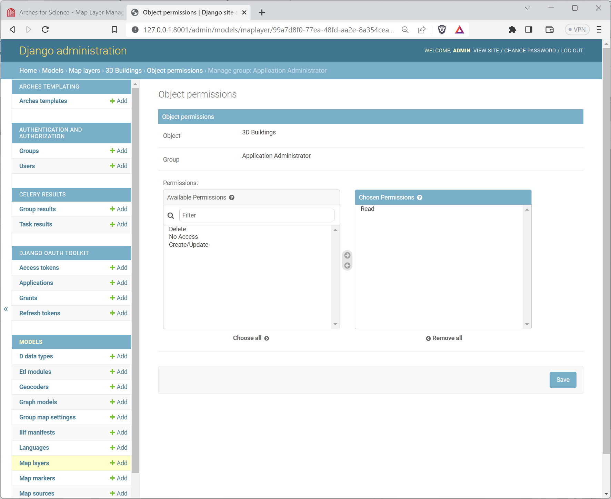

####################
Managing Permissions
####################

Arches provides a robust permissions system that allows administrators to control who can access different parts of the application, as well as who can access and modify different resource instances. This is important for ensuring that only authorized users can access or change sensitive data or make changes to the system.

----------------------
Permissions Frameworks
----------------------
The resource instance permission system is customizable (starting with Arches 7.6.). This means that you can choose a permissions framework to determine how permissions are applied to your resources and - if desired - you can even write your own.  Because of how permissions are applied to documents within Elasticsearch, if you choose to change your permissions framework, you will have to reindex your database.

Starting with Arches version 7.6, Arches comes with two different general permissions frameworks: 1) `Default Allow`, and 2) `Default Deny`.

Default Allow
^^^^^^^^^^^^^
The first "standard" (current behavior and default) permissions framework defaults to allow all resource instance data to be accessible (even to anonymous users) unless otherwise specified. This default standard behavior is most suitable for public-facing applications where all data is intended to be accessible to all users. Default Allow has the following behaviors:   

* If the user is a superuser or principal user, permission is allowed.
* If there are no explicit permissions applied at the user or group level, the user is allowed access (implicit allow).  
* If ``no_access`` is specified at the user level, access is denied.  
* If access is allowed at the user level, access is allowed.  
* If ``no_access`` is specified at the group level (in any group), access is denied.  
* If access is permitted at the group level (in any group) access is allowed.  

Default Deny
^^^^^^^^^^^^
The second "default deny" (strict) permissions framework defaults to deny all resource instance data access (even to authenticated users) unless otherwise specified. This default strict behavior is most suitable for private applications and implementations that manage sensitive data that is intended to be restricted to only certain users. The default deny permissions framework aligns with a ":ref:`Principle of Least Privilege`" model for managing security.

Default Deny is designed to provide a simpler, more intuitive experience with permissions.  As such, the ``no_access`` permission is not used. By default, all users (except for the superuser, which can see all resources, and the creator of the resource) cannot see *any resources*.  Permissions must be added for all resources - either at the group level or user level. This can be done explicitly through the permissions manager or - optionally - one can use default permissions to specify resource level permissions that are applied across Arches. Default Deny has the following behaviors:

* If the user is a superuser or principal user, permission is allowed.
* If there are no explicit permissions at the group or user level, permission is denied.
* If there are explicit allow permissions at the user level, the user is allowed.
* If there are explicit allow permissions at the group level, the user is allowed.  

Specifying a Permissions Framework
^^^^^^^^^^^^^^^^^^^^^^^^^^^^^^^^^^

The permissions framework can be set in the ``settings.py`` or the ``settings_local.py`` file by setting the value of the ``PERMISSIONS_FRAMEWORK`` variable. One can implement the "default deny" permissions framework by setting that variable, or one can use that variable to specify a custom permissions framework (that you would have to first install and configure). 

To set the "default deny" permissions framework, make the following update:

.. code-block:: python

  PERMISSION_FRAMEWORK = "arches_default_deny.ArchesDefaultDenyPermissionFramework"

Default (Resource Model) Permissions with Default Deny
^^^^^^^^^^^^^^^^^^^^^^^^^^^^^^^^^^^^^^^^^^^^^^^^^^^^^^

Starting with version 7.6, Arches supports default permissions at the resource model level.  These are only supported for the default deny permission framework. This allows you to specify permissions in your settings.py file that can be applied to a given graph.  These permissions can be group or (less ideally) user level permissions. To use this feature, you need the graph IDs (can be obtained in the graph designer) and User or Group IDs - which can be obtained in the Django admin site (see: :ref:`Django Admin User Interface`).

To set default permissions for one or more graphs, add the following to your ``settings.py`` or ``settings_local.py`` file:

.. code-block:: python

  PERMISSION_DEFAULTS = {
    "some-graph-id": [
      # Below, we let users in group ID 11 have view_resourceinstance privileges
      # for all resource instances in the 'some-graph-id' resource model.
      {
        "id": 11, 
        "type": "group", 
        "permissions": [
          "view_resourceinstance",
        ],
      },
      {
        "id": 11, 
        "type": "group", 
        "permissions": [
          "view_resourceinstance",
        ],
      },
      # Below, we let user ID 8 have change_resourceinstance privileges
      # for all resource instances in the 'some-graph-id' resource model.
      {
        "id": 8, 
        "type": "user", 
        "permissions": [
          "change_resourceinstance",
        ],
      },
    ],
  }

-------------------------
Administering Permissions
-------------------------

Permissions in Arches are handled on a few different levels.

* `Managing Users and Groups in Django Admin`_

  *Determine who can access what parts of Arches using the built-in Django admin interface.*

* `Resource Model Permissions`_

  *Determine which Users and Groups can read/edit/delete specific portions of a Resources Model.*

* `Resource Instance Permissions`_

  *Grant access to specific Resource instances on a per-User and/or per-Groups basis.*

* `Media Permissions`_

  *Restrict access to site media.*

* `Map Layer Permissions`_

  *Restrict access to map layers.*

Managing Users and Groups in Django Admin
-----------------------------------------

Arches is a complex platform, and some users must be able to access specific areas of the application while being restricted from others.
This level of access is handled by adding Users to certain Groups through the Django admin interface.

.. note::
  You can access the Django admin at ``localhost:8000/admin``, the default admin credentials are ``admin/admin``,
  which must be changed in production. **Any user with "staff" status can access the Django admin panel.**

Once logged into the admin panel, you'll see this at the top of the page:

    Arches site administration in Django admin panel.

Click **Users** to see a list of all your Arches users. Selecting a user will yield a generic
profile page like this:

    User's admin profile

In the "Permissions" section here there are three fields.

:Active: This account is active and the user can log in. Unchecking this box allows you to retain a user account while disallowing them from accessing Arches.
:Staff status: This user can access (and make changes within) the Django admin panel.
:Superuser status: This user has full access to the entire Arches platform, and is considered a member of every Group.

Next, you'll see where you can assign the user to different Groups. Arches comes with many default
different groups, and each one gives its members access to different parts of the application. A user can be
a member of as many different groups as needed.

:Graph Editor:
  :Use Case: For creating and testing branches and models.
  :Access Privileges: Create/design graphs, branches, functions, and RDM. Add/edit business data with Resource Editor privileges. Unable to access system settings or mobile projects.

:Resource Editor:
  :Use Case: Ability to add/edit/delete provisional data more liberally than a Crowdsource Editor user.
  :Access Privileges: Add/edit/delete resources.

:RDM Administrator:
  :Use Case: Add/edit/manage RDM concepts
  :Access Privileges: Full access to the RDM - no access to the rest of Arches.

:Application Administrator:
  :Use Case: Control over Django admin page... can add/edit/delete users and user groups within Django admin console
  :Access Privileges: Has Django superuser status (see above) which gives it full access to Arches.

:System Administrator:
  :Use Case: Changing data stored in the system settings graph.
  :Access Privileges: Ability to access/edit data in Arches System Settings.

:Crowdsource Editor:
  :Use Case: Creation of provisional data from an untrusted source. Default group user is assigned to when first added to the system via e-mail sign-up.
  :Access Privileges: Add/edit/delete resources your own provisional data tiles

:Guest:
  :Use Case: Read-only access for anonymous users (non-authenticated users are automatically in this group)
  :Access Privileges: Read-only access to all business data

:Resource Reviewer:
  :Use Case: Review provisional data and promote it to authoritative
  :Access Privileges: Add/Edit authoritative business data. Ability to promote provisional data to authoritative.

:Resource Exporter:
  :Use Case: Control permissions to make exports of search result resource instances
  :Access Privileges: This group was added in Arches version 7.4.0. Membership in this group is now *required* to export resource instance data from search results. By default, the ``anonymous`` user is a member of this group. If you want to disable export of resource instance data from searches for anonymous users, remove the ``anonymous`` user from this group. Similarly, you can control resource instance export privileges for other users by adding or removing them from the ``Resource Exporter`` group.

Feel free to make new groups as needed, but do not remove any of those listed above. Groups are also used in
other aspects of permissions as described below.

Resource Model Permissions
-----------------------------
Permissions are applied to each card and by default, the guest user (aka anonymous user) has read privileges to all data.
If you have data you do not want to share with all users, follow these directions when designing your database: :ref:`Permissions Tab`.

Resource Instance Permissions
-----------------------------
https://github.com/archesproject/arches-docs/issues/218

Media Permissions
-----------------

If you want to ensure that all media file (uploaded photographs, etc.) access requires authentication, you can set RESTRICT_MEDIA_ACCESS to True.

Be aware that in doing so, all media file requests will be served by Django rather than Apache. This will adversely impact performace when serving large files or during periods of high traffic.

In ``settings_local.py`` add this line::

    RESTRICT_MEDIA_ACCESS = True

Map Layer Permissions
---------------------

As of Arches version 7.4.0, you can assign different permissions to specific Arches *users* and *groups*. To manage **Map Layer Permissions**, login to the :ref:`Django Admin User Interface <django admin user interface>` and click the link to "Map layers" under models, and then click on the specific Map Layer that you'd like to update for permissions.

To update permissions of a specific Map Layer, navigate to the *OBJECT PERMISSIONS* link in the upper right as illustrated below:

    Link to the Object Permissions update form for a Map Layer in the Django Admin panel.

.. note::
  You will **ALSO** need to make sure the ``Ispublic`` flag for the Map Layer is deactivated. That flag is located lower down, well below the the link to the *OBJECT PERMISSIONS*, see below:

  .. figure:: ../images/arches-django-admin-map-layer-permissions-1b.png
      :width: 100%
      :align: center

      Location of the ``Ispublic`` flag for a Map Layer in the Django Admin panel.

Once you click the *OBJECT PERMISSIONS* link, you will see a form that will let you name users (by their username) and groups, by their group name. Once you add the name for the user or group, press the "Manage user" or "Manage group" button as appropriate. See the illustration below for an example:

    Adding a Group Name to the Object Permissions for a Map Layer in the Django Admin panel.

After clicking the "Manage user" or "Manage group" button, you will reach another form where you can add or subtract specific permissions for this user (or group) and Map Layer. See the illustration below for an example:

    Editing a group's specific permissions to a Map Layer in the Django Admin panel.

Once you have updated the permissions, it's a good idea to test the Arches interface to make sure the permissions for the Map Layer are properly applied.