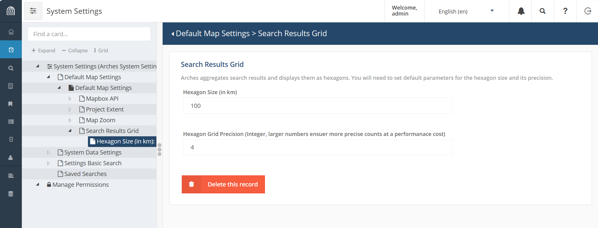
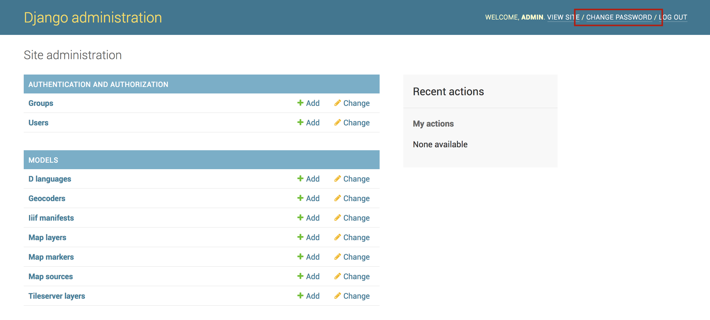

######################
Arches System Settings
######################

.. seealso::

    This section covers configuration settings that are managed through a browser. You will likely need to update other :ref:`settings that are defined elsewhere <Settings - Beyond the UI>`.

Arches System Settings Interface
--------------------------------

These are the settings found at ``http://localhost:8000/settings``.

Default Map Settings
====================

*Mapbox API*

Arches uses the Mapbox mapping library for map display and data creation. Arches also supports Mapbox basemaps and other services.

+ **Mapbox API Key (Optional)** - By default, Arches uses some basemap web services from Mapbox. You will need to `create a free API key <"https://www.mapbox.com/help/create-api-access-token/">`_ (or "access token") for these services to be activated. Alternatively, you could remove all of the default basemaps and add your own, non-Mapbox layers.
+ **Mapbox Sprites** - Path to Mapbox sprites (use default).
+ **Mapbox Glyphs** - Path to Mapbox glyphs (use default).

*Project Extent*

Draw a polygon representing your project's extent. These bounds will serve as the default for the cache seed bounds, search result grid bounds, and map bounds in search, cards, and reports.

*Map Zoom*

You can define the zoom behavior of your maps by specifying max/min and default values. Zoom level 0 shows the whole world (and is the minimum zoom level). Most map services support a maximum of 20 or so zoom levels.

*Search Results Grid*

Arches aggregates search results and displays them as hexagons. You will need to set default parameters for the hexagon size and precision. Aggregating search results into a hexagonal grid can greatly improve performance of the map user-interface because fewer geometric features need to be delivered to a client's browser.

    Arches system settings for map search results grid

The Arches Elasticsearch component indexes a geohash of location data that powers efficient aggregation of geographic locations for resource instances. However, to enable map display of search results aggregated in a hexagonal grid, you first need to add a map layer that has includes ``"source": "search-results-hex"`` in the layer definitions. You can read more about adding map layers (see :ref:`Creating New Map Layers`) or you can use SQL to insert a hex grid map layer as below:

.. code-block:: sql

    INSERT INTO map_layers(maplayerid, name, ispublic, searchonly, sortorder, layerdefinitions, isoverlay, icon, activated, addtomap)
    VALUES (public.uuid_generate_v1mc(), 'Hex', true, true, 0, '[
        {
            "layout": {},
            "source": "search-results-hex",
            "filter": [
            "==",
            "id",
            ""
            ],
            "paint": {
            "fill-extrusion-color": "#54278f",
            "fill-extrusion-height": {
                "property": "doc_count",
                "type": "exponential",
                "stops": [
                [
                    0,
                    0
                ],
                [
                    500,
                    5000
                ]
                ]
            },
            "fill-extrusion-opacity": 0.85
            },
            "type": "fill-extrusion",
            "id": "search-results-hex-outline-highlighted"
        },
        {
            "layout": {},
            "source": "search-results-hex",
            "filter": [
            "all",
            [
                ">",
                "doc_count",
                0
            ]
            ],
            "paint": {
            "fill-extrusion-color": {
                "property": "doc_count",
                "stops": [
                [
                    1,
                    "#f2f0f7"
                ],
                [
                    5,
                    "#cbc9e2"
                ],
                [
                    10,
                    "#9e9ac8"
                ],
                [
                    20,
                    "#756bb1"
                ],
                [
                    50,
                    "#54278f"
                ]
                ]
            },
            "fill-extrusion-height": {
                "property": "doc_count",
                "type": "exponential",
                "stops": [
                [
                    0,
                    0
                ],
                [
                    500,
                    5000
                ]
                ]
            },
            "fill-extrusion-opacity": 0.5
            },
            "type": "fill-extrusion",
            "id": "search-results-hex"
        }
    ​
    ]', true, 'ion-funnel', true, false);

.. warning:: A large project area combined with a small hexagon size and/or high precision will take a very long time to load, and can crash your browser. We suggest changing these settings in small increments to find the best combination for your project.

System Data Settings
====================

*Default Application Names*

+ **Application Name** - Name of your Arches app, to be displayed in the browser title bar and elsewhere.
+ **Default Data Import/Export Name** - Name to associate with data that is imported into the system.

*Web Analytics*

If you have made a Google Analytics Key to track your app's traffic, enter it here.

*Thesaurus Service Providers*

Advanced users may create more SPAQRL endpoints and register them here. These endpoints will be available in the RDM and allow you to import thesaurus entries from external sources.

Saved Searches
==============

Arches allows you save a search and present it as convenience for your users. Saved Searches appear as search options in the main Search page. Creating a Saved Search is a three-step process.

#. **Specify Search Criteria** - Go to the Search page and enter all the criteria you would like to use to configure your Saved Search. You may notice that with the addition of each new search filter (either by using the term filter, map filtering tools, or temporal filters) the URL for the page will change.
#. **Copy the URL** - In your browser address bar, copy the *entire* URL. This will be a long string that defines each of the search filters created in step 1.
#. **Create the Saved Search** - Finally, head back to this page and fill out the settings that you see at left. You can also upload an image that will be shown along with your Search Search.

Settings Basic Search
=====================

Set the default search results behavior. This is also where you will define the max number of resources per export operation.

Temporal Search Settings
========================

Arches creates a Time Wheel based on the resources in your database, to allow for quick temporal visualization and queries. A few aspects of this temporal search are defined here.

+ **Color Ramp** - Currently unused (saved for future implementation). The color ramp for the time wheel. For further reference, check out the `d3 API reference <https://github.com/d3/d3-3.x-api-reference/blob/master/Ordinal-Scales.md>`_.
+ **Time wheel configuration** - Currently unused (saved for future implementation).  You can, however, modify the time wheel configuration using the advanced settings, :ref:`Time Wheel Configuration`.

Maintaining Arches System Settings
----------------------------------

Because these settings are stored in the database, as opposed to a ``settings.py`` file, if you drop and recreate your database, you will lose them and need to re-enter them by hand. To avoid this, you should run this command *after* you have finished configuring settings through the UI::

    python manage.py packages -o save_system_settings [-d arches/db/system_settings]

A file named "System_Settings.json" will be saved to the directory indicated. If no directory is indicated the file will be saved to settings.SYSTEM_SETTINGS_LOCAL_PATH, which is ``my_project/my_project/system_settings/`` by default. This same path is used to import settings when a new package is loaded into your project.

Changing the Admin Password
---------------------------

The first item of business when preparing your production of Arches is to change the Admin user's password. You cannot change the Admin user's password in the Arches UI because the Admin account is not associated with an email. Instead you'll need to use the Django admin page:

1. Login as admin to Arches or in the Django admin (``http://localhost:8000/admin/``)
2. Navigate to the Django admin user page ``http://localhost:8000/admin/auth/user/``.
3. In the upper right of the page select ``CHANGE PASSWORD`` and follow the steps to update the password.

