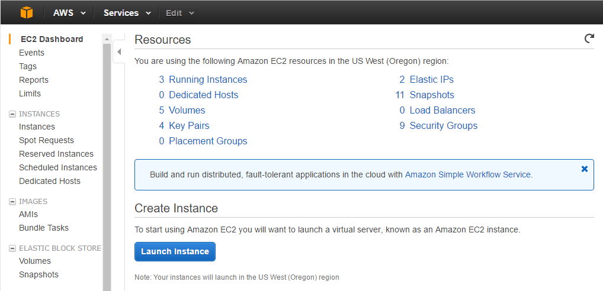
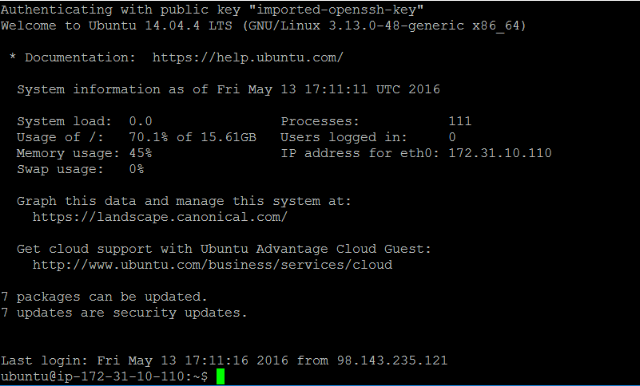

################################
Migrating a Local App to AWS EC2
################################

If you've been doing your Arches development work locally you will eventually need
to transfer your app to a remote server of some kind in order for it to be served
through the Internet. This can be done in many different ways, and in this section
we'll give an introductory explanation of how to use Amazon Web Services (AWS) to
deploy Arches.

Overview
========

AWS includes dizzying array of systems and services. AWS names different computing services using an alphabet soup of (initially) cryptic acronymns. Acronyms mentioned in this documentation include:

  AWS:
    Amazon Web Services
  ALB:
    Application Load Balancer (ALB) provides (in this context) a means to manage requests from the outside Internet before they get directed to your EC2 instance running Arches.
  EC2:
    Amazon Elastic Compute Cloud (EC2) provides virtual servers with different processing speeds, memory, hard drives, and operating systems. You can install your own software (such as Arches) on EC2 instances.
  RDS:
    Amazon Relational Database Service (RDS) provides Amazon managed database servers (including Postgres servers) that you can use instead of manually installing and managing a database server on an EC2 instance.
  S3:
    Amazon Simple Storage Service (S3) provides a scalable file storage and hosting infrastructure.
  IAM:
    Amazon Identity and Access Management (IAM) service sets security and permissions roles and policies for different users, different applications and services, and different computing instances.

While it can be very intimidating to get started, Amazon Web Services are so widely used that you can easily find some excellent guidance and help.

This guidance is primarily intended to provide a basic introduction for simple AWS deployment architectures. Some organizations use AWS for relatively small-scale and simple projects,
and others use AWS to run large-scale and very complicated systems. An AWS deployment architecture may vary widely according to
different security requirements, scales, backup strategies, maintainability needs, and uptime and performance needs.

To help get you started, this documentation focuses on simple initial AWS deployments. An organization should consult with AWS experts in cases where there are significant security, scale, reliability, or performance requirements. Please look elsewhere for guidance on server administration and maintenance.

Example Deployment Architectures
---------------------------------
As noted above, you should carefully align your deployment architecture according to your specific requirements, budget, and proficiency with AWS services. This introduction illustrates just two of a wide variety of architecture options:

1. A Single Node Deployment (one EC2 instance)

  The most simple AWS deployment architecture essentially mimics deployment of Arches that runs as a localhost on your own machine. In this architecture, the Arches application runs on a single EC2 instance `along with` the dependency Postgres database server and dependency Elasticsearch server. As described in the diagram below, the only other AWS service used outside of this one EC2 instance is S3 (to configure, see: :ref:`Using AWS S3 or Other Cloud Storage` ), for storage for user uploaded files.

  .. figure:: ../images/aws-single-node-simple-architecture.png
    :width: 75%
    :align: center

    Arches deployed on a single EC2 instance.

2. A Multiple Node Deployment (two EC2 instances and RDS)

  If you require greater performance, you can consider an architecture that uses multiple EC2 instances together with other AWS services, especially the RDS service. For example, you can deploy the Elasticsearch server (an Arches dependency) on a separate EC2 instance. This avoids a scenario where the Arches core application and Elasticsearch compete for the same computing resources. Similarly, you can use the RDS service to provision a Postgres database for Arches, which again more widely distributes computation across a broader infrastructure. Using multiple EC2 instances together with the RDS service may be somewhat more expensive and may involve a bit more configuration and deployment effort, but this architecture will likely have scale and performance advantages. As described in the diagram below, (core) Arches and Elasticsearch each have their own EC2 instances, RDS provisions the Postgres database to Arches, and S3 provides storage for user uploaded files (to configure, see: :ref:`Using AWS S3 or Other Cloud Storage` ).

  .. figure:: ../images/aws-multi-node-distributed-architecture.png
    :width: 75%
    :align: center

    Arches deployed on multiple EC2 instances together with RDS.

AWS Security and Permissions Management
---------------------------------------
AWS provides extremely powerful and sophisticated tools to manage permissions and security. AWS emphasizes the management of "roles" and "policies" for security. You typically use the IAM service to set roles and policies that grant specific permissions to individuals or services. A good security practice is to follow "the principle of least privilege". This principle ensures that entities only have the bare minimum permissions necessary to perform their tasks.

.. note::
If you are managing sensitive information in Arches (or any other system) you should gain proficiency with AWS security good practices and a good understanding of network architecture. For example, if you deploy Arches using an EC2 instance on a public subnet, SSH access will be more convenient, but it will be less secure than putting the Arches EC2 instance in private subnet. The best choice of security practices and network protections will vary depending on the sensitivity of the information you manage and your operational / administrative needs.

Moving a Localhost Arches Project to EC2
=============
Now that we've introduced different considerations for deploying Arches on AWS, we can move into more specifics about how to move a locally hosted Arches instance to a "Single Node Deployment" (see the architecture described above).

.. warning::

  Some content below may be outdated. Both Arches and AWS are evolving systems. If you notice sections that need updating please alert us by submitting a ticket (https://github.com/archesproject/arches-docs/issues)!

Prerequisites
-------------

A few components must be in place before you are ready to complete these steps.

1. You will need an `AWS account <http://aws.amazon.com/getting-started/>`_, which is just an extension of a normal Amazon account.In the very beginning, do not worry about pricing; if you are new to AWS, everything listed below will fall in the "free tier" for one year.

2. You'll need an SSH client in order to access your remote server's command console. For Windows, we recommend `PuTTY <https://putty.org/>`_ as an easy to use, light-weight SSH client. While downloading PuTTY, also be sure to get its companion utility, PuTTYgen (from the same webpage).

3. You'll need an FTP client in order to transfer files (your Arches app customizations) to your server. We recommend `FileZilla <https://filezilla-project.org/>`_.

Once you have an AWS account set up, and PuTTY/PuTTYgen and FileZilla installed on your local computer, you are ready to begin.

.. note::
  Experience with command line tools, especially those that involve the management of security (encryption) certificates (such as ``ssh`` and ``scp``) is typically necessary to deploy and manage Arches on remote cloud computing services.

Create an EC2 Instance
----------------------

From your AWS account console, navigate to the EC2 section. You should get to a screen that looks something like this:

  A (dated) view of the EC2 dashboard (AWS dashboard interfaces frequently change)

Click on "Launch Instance"

You now have the opportunity to customize your instance before you launch it, and you should see seven steps listed across the top of the page. For our purposes, we only need to worry about a few of them:

* In Step 1, choose "Ubuntu Server 22.04 LTS" as your operating system
* In Step 2, choose an instance type
* In Step 3, tag your server with a name (this is helpful, though not necessary)
* In Step 4, you'll need to:
    * Select "Create a new security group"
    * Name it "arches-security"
    * Modify the rules of this security group to match the following

      ================ ========= =========== ====================
      Type             Protocol  Port Range  Source
      ================ ========= =========== ====================
      HTTP             TCP       80          Anywhere (0.0.0.0/0)
      HTTPS            TCP       443         Anywhere (0.0.0.0/0)
      Custom TCP Rule  TCP       8000        Anywhere (0.0.0.0/0)
      SSH              TCP       22          My IP
      ================ ========= =========== ====================

* In Step 5, click Launch

When you launch the instance, you will be asked to create a new key pair. This is very important. Name it something like "arches-keypair", and download it to an easy-to-access location on your computer. You will use this later to give the SSH and FTP clients access to your server. **Do not misplace this file.**

Once you have launched the instance, click "View Instances" to see your running (and stopped) EC2 instances. The initialization process takes a few moments, so we can leave AWS alone for now and head to the next step.

**NOTE** Your Security Group is the firewall for your server. Each rule describes a specific type of access to the server, through a specific port, from a specific IP address. `Never` allow access through port 22 to any IP but your own. If you need to access your server from a new location (library, university) you'll need to update the SSH security rule with your new IP address.

Convert your AWS .pem Key Pair to a .ppk Key Pair
-------------------------------------------------

PuTTY uses key files in a different format than AWS distributes by default, so you'll have to make a quick conversion:

1. Open PuTTYgen
2. Click Load
3. Find the .pem file that you downloaded when launching your instance (you may have to switch to "All Files (*.*)")
4. Once loaded, click Save
5. Ignore the prompt for a passphrase, and save it with the same name as your original .pem file, now with the .ppk extension.

Connect to your EC2 Instance with PuTTY
---------------------------------------

Now go back to AWS, and look at the status of your server instance. By now, it probably says "2/2 checks passed" in the Status Checks column, and you should have an address (xx.xx.xx.xx) listed in the Public IP column. It's ready!

1. Open PuTTY, and enter your server's Public IP into the Host Name bar.  Make sure Port = 22, and the Connection Type is SSH (remember the security rules we were working with?).
2. To make PuTTY aware of your key file, expand the SSH section in the left pane, and click on Auth. Enter your .ppk file as the "Private key file for authentication".
3. Once you have the IP Address and key file in place, click Open.
4. Click OK to trust the certificate, and login to your server as the AWS default user `ubuntu`.
5. If everything goes well you should be greeted with a screen like this:

Congratulations! You've successfully navigated your way into a functional AWS EC2 instance.

Install Arches Dependencies on your EC2 Instance
------------------------------------------------

Now that you have a command line in front of you, the next few steps should be very familiar. Luckily, if you are coming from Windows, you'll find that installing dependencies on Ubuntu is much, much easier. Do all of the following from within the `/home/ubuntu` directory (which shows as ~ in the command prompt).

1. Download the install script for dependencies (this links to the v7.5.0 dependencies install, update the link for your specific version)

  .. code-block::

    $ wget https://raw.githubusercontent.com/archesproject/arches/stable/7.5.0/arches/install/ubuntu_setup.sh

2. Run it (this may take a few minutes)

  .. code-block::

    $source ./ubuntu_setup.sh

Install Arches and on your EC2 Instance
---------------------------------------
There's no hard and fast rule about where in the filesystem you should install Arches on an EC2 instance. A typical deployment scenario would be to install Arches on an Ubuntu EC2 instance. For that kind of instance, Amazon will provide SSH credentials to log in as the `ubuntu` user (with super user privileges). That means when you login via SSH to your Arches EC2 instance, you should find yourself in the ``/home/ubuntu`` directory.

For sake of simplicity and consistency, we'll assume you will be installing Arches within the ``/home/ubuntu`` directory. However, you may choose an alternate location like a sub-folder of the ``/opt`` directory. The ``/opt`` directory may be more convenient if you want to make Arches easier to manage by multiple people with different user accounts.

Once you have the dependencies installed, see :ref:`Installing Core Arches`, you can copy your Arches project from your local machine to the desired location on your Arches EC2 instance. You can use Filezilla to do that, or use the command-line utility ``scp``.

Connect to your EC2 Instance with Filezilla
-------------------------------------------

To transfer files from your local environment to your EC2 instance, you'll need to use an FTP client. In this case we'll use FileZilla.

First, we'll need to set up the authentication system to be aware of our AWS key file.

1. Open FileZilla
2. Go to Edit > Settings > SFTP and click Add key file...
3. Navigate to your .ppk file, and open it. You'll now see you file listed.
4. Click OK to close the Settings

Next, you can use the "Quickconnect" bar:

* Host = your server's Public IP
* Username = ubuntu
* Password = <leave blank> (that's what the .ppk file is for)
* Port = 22

Once connected, you'll see your server's file system on the right side, and your local file system on the left. Find your local "my_hip_app" directory, and copy the entire directory to `/home/ubuntu/Projects/`. This example directory structure is consistent with related documentation explaining how to set up Apache or Nginx for use with Arches, see: :ref:`Serving Arches with Apache or Nginx`

Next, use this command to remove the elasticsearch installation from your new app on the server (because ElasticSearch should be *installed* on on your EC2 instance).

  .. code-block::

    (ENV)$ sudo rm -r my_hip_app/my_hip_app/elasticsearch

Now you can run these final commands from the `/home/ubuntu/Projects/my_hip_app` directory to complete your app's installation on the server:

1. Install ElasticSearch

  .. code-block::

    (ENV)$ python manage.py packages -o setup_elasticsearch

2. Run ElasticSearch

  .. code-block::

    (ENV)$ my_hip_app/elasticsearch/elasticsearch-8.5.3/bin/elasticsearch -d

3. Run the devserver

  .. code-block::

    (ENV)$ python manage.py runserver 0:8000

.. note::
  In this case, explicitly setting the host:port with `0:8000` ensures that the server is visible to us when we try to view it remotely.

You should now be able to open any web browser and view your app by visiting your IP address like so: http://xx.xx.xx.xx:8000. Now that you have transferred your app to a remote server, its time to use a real production-capable webserver like Apache to serve it (that's how we can get rid of the :8000 at the end of the url). If you can't see Arches, check AWS networking permissions to make sure port ``8000`` is accessible. But once you've verified Arches is working, *DO NOT* leave port ``8000`` open. Leaving it open will be a security risk.

Another way to check would be SSH onto your Arches EC2 instance and use curl to see if Arches is responding.

.. code-block::

  curl http://localhost:8000

If the above command gives you raw HTML, then Arches is functioning and responding to requests to port 8000.

Keep in mind that you may need to have different values in your `settings.py` file once you have transferred it to a new operating system (GDAL_PATH, for example). To handle this, create and use a different `settings_local.py` file on each installation.

More Advanced Configurations
----------------------------
As noted above AWS security management can complex. It is best to consult with experts in AWS to get advice about your specific deployment scenario. Generally speaking, when implementing a "Multiple Node Deployment" (see above) architecture, you should set up a unique (and clearly named) security group for each EC2 instance and the RDS instance involved in your deployment. You can then set the minimum required "inbound" rules that allow members of each of these security groups to connect as needed. For example, an EC2 instance running ElasticSearch would have its own security group. That ElasticSearch security group would have an inbound rule that allows connections from the Arches EC2 instance security group at the desired port (the default port for client, like Arches, API calls connecting with ElasticSearch is 9200).

Some additional (advanced) considerations include:

1. *RDS installation of PostGIS (geo-spatial) extensions*: If you use RDS for serving an Arches database, you may want to review `official documentation <https://docs.aws.amazon.com/AmazonRDS/latest/UserGuide/Appendix.PostgreSQL.CommonDBATasks.PostGIS.html>`_ on how to add the required PostGIS extensions.

2. *Arches Allowed Hosts*: In ``settings.py`` (sometimes set via ``settings_local.py``) you will need to add multiple items to the list of ``ALLOWED_HOSTS``. Consider the following example:

.. code-block:: python

  ALLOWED_HOSTS = ["my-arches-site.org", "localhost", "127.0.0.1", "ip-10-xxx-x-x.eu-west-2.compute.internal", "10.xxx.x.x", "ip-10-xxx-x-x"]

In that example, "my-arches-site.org" is the public domain name. But the items "ip-10-xxx-x-x.eu-west-2.compute.internal", "10.xxx.x.x", and "ip-10-xxx-x-x" are all AWS internal network addresses for the EC2 instance where Arches is deployed. You may need all of these for Arches to work properly.

3. *Arches CSRF Trusted Origins*: Django 4.0, a dependency of Arches 7.5 introduced a new setting for security purposes. In the ``settings.py`` (sometimes set via ``settings_local.py``) you will need to add multiple items to the list of ``CSRF_TRUSTED_ORIGINS``. If you don't include this, users will encounter CSRF error (403) when they attempt to login. See the `Django documentation for details <https://docs.djangoproject.com/en/5.0/releases/4.0/#csrf-trusted-origins-changes>`_. Note the following items (with the ``https://`` prefix):

.. code-block:: python

  CSRF_TRUSTED_ORIGINS = ["https://my-arches-site.org", "https://www.my-arches-site.org",]

Next Steps: Configuration with Apache or Nginx
----------------------------------------------
Once you've verified that you have properly installed Arches and its dependencies on your EC2 instance, it's time to configure Arches to work with either Apache or Nginx web servers. Apache or alternatively Nginx play an important role in security and performance. Configuring Apache or Nginx is a *necessary* aspect of deploying Arches in production. Please review :ref:`Serving Arches with Apache or Nginx` to learn more about production deployment of Arches.