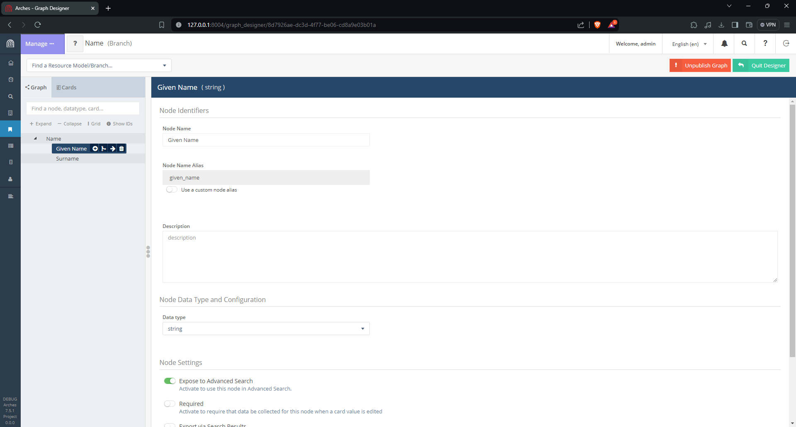
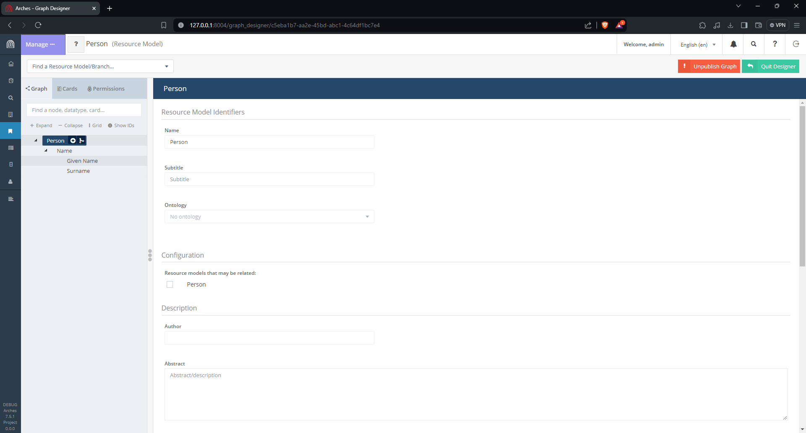
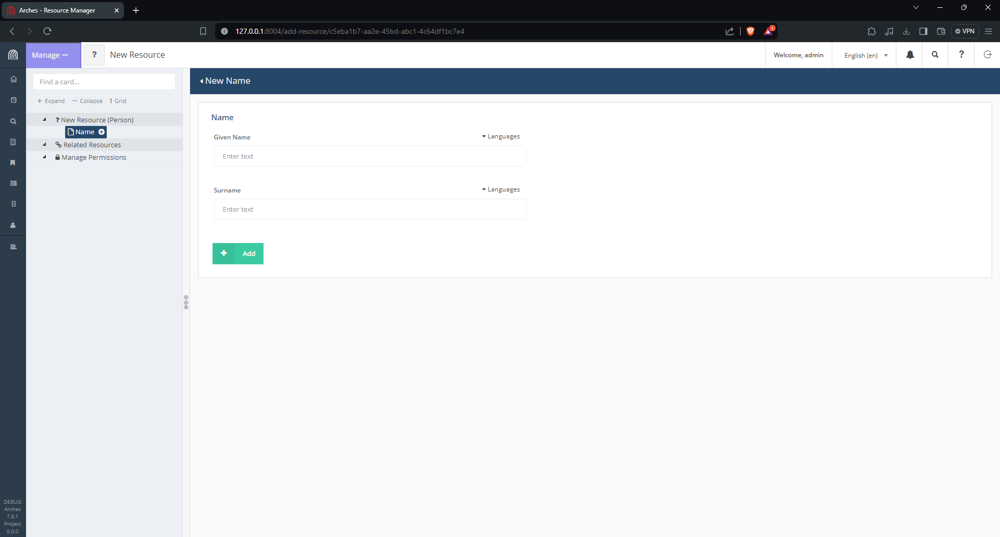
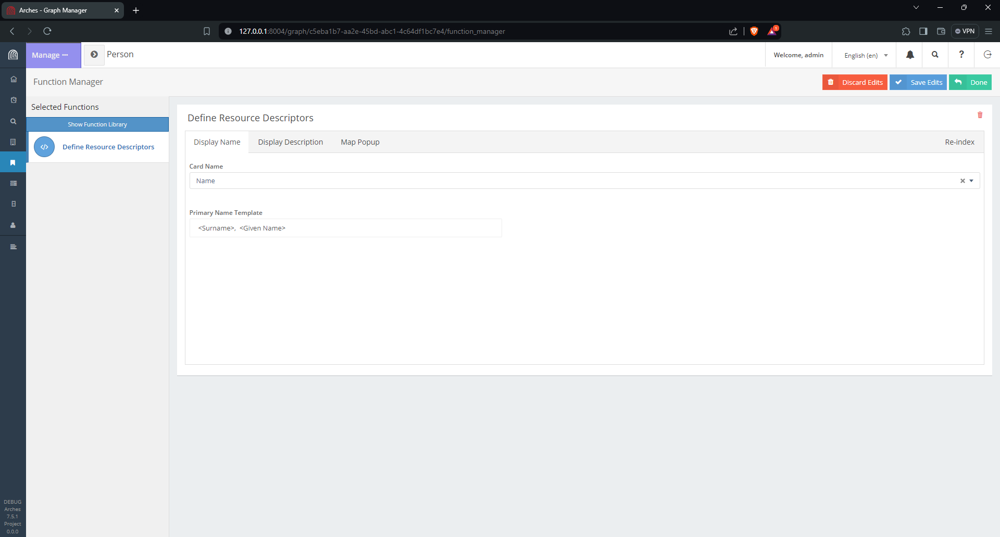

############################
Arches Use of the Django ORM
############################

Arches is built on Django, a powerful, popular, well-supported and well-documentant Python language web framework. This guide is intented to help guide developers already familiar with Django to better understand the Arches backend. The main focus here will center on how Arches uses the `Django Object Relational Model (ORM) <https://docs.djangoproject.com/en/5.0/topics/db/models/>`_ to power a highly configurable (and semantic, if one chooses to use ontologies) abstract :ref:`Data Model`. 

The Arches :ref:`Data Model` documentation provides an invaluable reference to understand Arches implementations of Django ORM models. This page provides more of a "guided tour" that illustrates how the Arches information you see in a browser may be reflected in Django `query sets <https://docs.djangoproject.com/en/5.0/topics/db/queries/#retrieving-objects>`_ and objects (individual records). 

Exploring a (Nearly) Empty Database
===================================
In this guide, we will start with a freshly installed and nearly empty Arches instance to make exploration easier. If you haven't yet installed Arches, please review and follow this :ref:`Installing` guide. To avoid permissions complications, login to your new Arches instance as an administrator (super user). We will then use the :ref:`Arches Designer` to set up a simple Branch and a Resource Model. 

.. important::

    + The UUIDs will be randomly generated and differ from these examples. You'll need to replace UUID identifiers with those present in your own Arches instance.

1. Build a Branch
-----------------
Use the Arches Graph designer to make a branch and a resource model. In this demonstration case, we're making a simple branch for "Name" with two child nodes ("Given Name" and "Surname"). 

    Arches Designer user interface to create a new "Name" branch.

2. Build a Resource Model
-------------------------
After publishing this new "Name" branch, we can use it to describe resource models. Here, we're in the process of adding the "Name" branch to a "Person" resource model.

    Arches Designer user interface to create a new "Person" resource model.

This results in the "Person" resource model with a "Name" branch. After one clicks on the "Publish Graph" button, we can create business data. In our example, that business data will include resource instances (of the Person resource model) and names (configured with the Name branch). 

3. Add a Resource Instance
--------------------------
Using the "Add New Resource" user interface, we can add a Person resource instance with name information. Once you save your new resource instance, let's explore how the information is represented in the Django ORM used by Arches.

    Adding a resorce instance

4. Open a Terminal to Explore the ORM
-------------------------------------
Now that you have used the Arches user interface to define a branch, a resource model, and have used these to create a resource instance, we can turn our attention to exploring how this information is represented in the Arches implementation of the Django ORM.

Assuming you’ve activated your virtual environment for Arches, use a terminal to open a shell into the Arches Django application:

.. code-block:: bash

    python manage.py shell

Your terminal should display something like this:

.. code-block:: python

    Python 3.11.8 (main, Mar 12 2024, 11:41:52) [GCC 12.2.0] on linux
    Type "help", "copyright", "credits" or "license" for more information.
    (InteractiveConsole)
    >>>

5. Import Arches Models and Explore the GraphModel
--------------------------------------------------
Now we should import some of the key Django models used by Arches to organize data. After importing these models, we can investigate how Arches represents the "Name" branch and the "Person" resource model that we already created using the user interface.

.. code-block:: python

    Python 3.11.8 (main, Mar 12 2024, 11:41:52) [GCC 12.2.0] on linux
    Type "help", "copyright", "credits" or "license" for more information.
    (InteractiveConsole)
    >>> from arches.app.models.models import GraphModel

Let's first take a look at the GraphModel. The GraphModel is used to store records of both branches and resource models.

.. code-block:: python

    >>> gr_qs = GraphModel.objects.all()
    >>> gr_qs.count()
    3

You'll see we have 3 objects in our queryset to select all items from the GraphModel. But we only made one branch, and one resource model! Where does the other GraphModel object come from?

To answer this question, let's investigtate further by looking at an individual object from the query set. The ``.__dict__`` outputs the object as a dict, making it easier to see the information that it contains.

.. code-block:: python

    >>> gr_obj = gr_qs.last()  # Get the last object in this queryset
    >>> gr_obj.__dict__
    {'_state': <django.db.models.base.ModelState object at 0x7f40110d3350>, 
    'graphid': UUID('ff623370-fa12-11e6-b98b-6c4008b05c4c'), 
    'name': <arches.app.models.fields.i18n.I18n_String object at 0x7f40110d18d0>, 
    'description': <arches.app.models.fields.i18n.I18n_String object at 0x7f40110d2f50>, 
    'deploymentfile': None, 'author': ' ', 'deploymentdate': None, 'version': '', 'isresource': True, 
    'iconclass': 'fa fa-sliders', 'color': None, 
    'subtitle': <arches.app.models.fields.i18n.I18n_String object at 0x7f40110d3050>, 
    'ontology_id': None, 'jsonldcontext': None, 'template_id': UUID('50000000-0000-0000-0000-000000000001'), 
    'config': {}, 'slug': None, 'publication_id': UUID('e437751c-e234-11ee-a712-0242ac120005')}

That looks a little difficult to understand especially because the name attribute has an `I18n_String object <https://github.com/archesproject/arches/blob/stable/7.5.1/arches/app/models/fields/i18n.py>`_. The I18n_String object is used by Arches to support internationalization. One can see the I18n_String object with:

.. code-block:: python

    >>> gr_obj.name.value
    '{"en": "Arches System Settings"}'
    >>> gr_obj.name.__str__()
    'Arches System Settings'

As you can see, the value of the I18n_String object is a JSON formatted string. Language codes ("en" in this case) are used as keys to different multi-lingual strings. One can get the string value for an I18n_String object, in the default language, with ``__str__()``.  So to output a more legible overview of try GraphModel queryset, try:

.. code-block:: python

    >>> [(gr_obj.graphid, gr_obj.name.__str__(), gr_obj.isresource) for gr_obj in gr_qs]
    [(UUID('ff623370-fa12-11e6-b98b-6c4008b05c4c'), 'Arches System Settings', True), 
    (UUID('c5eba1b7-aa2e-45bd-abc1-4c64df1bc7e4'), 'Person', True), 
    (UUID('8d7926ae-dc3d-4f77-be06-cd8a9e03b01a'), 'Name', False)]

Now we have a more clear picture of what's contained in the GraphModel queryset. The 'Arches System Settings' object was created in the process that set up the current Arches project. The two GraphModel objects that we created ('Person' and 'Name') are also present in the GraphModel queryset. The ``isresource`` attribute indicates that the 'Person' GraphModel object is a resource model. We can get an individual GraphModel object for our "Person" resource model by querying the Django ORM as so: 

.. code-block:: python
    >>> person_resource_model_obj = GraphModel.objects.get(graphid='c5eba1b7-aa2e-45bd-abc1-4c64df1bc7e4')
    >>> person_resource_model_obj.name.__str__()
    'Person'

6. Resource Instances and their GraphModels
-------------------------------------------
Now that we've explored the GraphModel and I18n_String objects, let's take a look at how Arches uses the Django ORM to manage "business data". In the context of Arches, "business data" means the database records (resource instances and their descriptions) managed within an Arches instance. At this point, we're assuming you have created a "Person" resource instance as discussed in Step 3 above. To start exploring business data, start with the following:

.. code-block:: python

    >>> from arches.app.models.models import ResourceInstance
    >>> from arches.app.models.resource import Resource

In this case ``Resource`` is a proxy model (see `Django's documentation for proxy models <https://docs.djangoproject.com/en/5.0/topics/db/models/#proxy-models>`_) for ``ResourceInstance``. The proxy model ``Resource`` adds some additional Python methods to the ``ResourceInstance`` model. Most of the discussion below will focus on use of the ``Resource`` proxy model. So let's make a Resource queryset and inspect the first object within this queryset:

.. code-block:: python

    >>> r_qs = Resource.objects.all()
    >>> r_obj = r_qs.first()
    >>> r_obj.__dict__
    {'_state': <django.db.models.base.ModelState object at 0x7f400f5f3150>, 
    'resourceinstanceid': UUID('a106c400-260c-11e7-a604-14109fd34195'), 
    'graph_id': UUID('ff623370-fa12-11e6-b98b-6c4008b05c4c'), 
    'graph_publication_id': UUID('f0a0bf6a-65af-46f2-9c08-62e21a56dffb'), 
    'name': <arches.app.models.fields.i18n.I18n_String object at 0x7f400faa7010>, 
    'descriptors': {'ar': {'name': None, 'map_popup': None, 'description': None}, 
    'en': {'name': None, 'map_popup': None, 'description': None}, 
    'he': {'name': None, 'map_popup': None, 'description': None}}, 
    'legacyid': 'a106c400-260c-11e7-a604-14109fd34195', 
    'createdtime': datetime.datetime(2024, 3, 14, 13, 58, 48, 564559), 
    'tiles': [], 'descriptor_function': None, 
    'serialized_graph': None, 'node_datatypes': None}

We can see right away that this Resource object has a graph_id that matches the graph_id of the 'Arches System Settings' that we explored earlier. You can see this by following the related objects as below:

.. code-block:: python

    >>> r_obj.graph.name.__str__()
    'Arches System Settings'

This particular resource instance that's associated with the 'Arches System Settings' was also created in the process that set up the current Arches project. Let's look for the resource instance from the "Person" model that we created. To do so, we can make a new Resource queryset filtering by resource instances that use the "Person" resource model. 

.. code-block:: python

    >>> person_r_qs = Resource.objects.filter(graph=person_resource_model_obj)
    >>> person_r_qs.count()
    1

As expected, since we've only made 1 resource instance using the "Person" resaource model the ``person_r_qs`` queryset has 1 object in it. Let's a take a look at this Person resource instance:

.. code-block:: python

    >>> person_r_obj = person_r_qs[0]
    >>> person_r_obj.graph.name.__str__()  # See the 'Person' Resource Model (GraphModel)
    'Person'
    >>> person_r_obj.__dict__
    {'_state': <django.db.models.base.ModelState object at 0x7fb15ef2ad50>, 
    'resourceinstanceid': UUID('e9012e8c-f1cc-4ade-84ea-9b73ed8cccf9'), 
    'graph_id': UUID('c5eba1b7-aa2e-45bd-abc1-4c64df1bc7e4'), 
    'graph_publication_id': UUID('b338fef6-eba6-11ee-8bd0-0242ac120005'), 
    'name': <arches.app.models.fields.i18n.I18n_String object at 0x7fb15ef29f90>, 
    'descriptors': {'ar': {'name': None, 'map_popup': None, 'description': None}, 
    'en': {'name': None, 'map_popup': None, 'description': None}, 
    'he': {'name': None, 'map_popup': None, 'description': None}}, 
    'legacyid': None, 'createdtime': datetime.datetime(2024, 3, 26, 14, 46, 41, 394410), 
    'tiles': [], 'descriptor_function': None, 
    'serialized_graph': None, 'node_datatypes': None}

7. Resource Instances and their Description
-------------------------------------------
In the example above, you'll see that the "descriptors" attribute has a dictionary keyed by different language codes (in this case 'ar', 'en', and 'he'). The descriptors attribute is used by Arches to populate information about resource instances in the user interface. In the example above, these descriptors have yet to be configured. Let's see what happens when we do configure resource instance descriptors.

Use the Arches Graph designer and navigate to the Resource Models tab. Hover over the "Person" resource model until you see the "Manage" button, and select the "Manage Functions" option. You can then configure the "Display Name" to use the "Name" (Card) with two child nodes "Given Name" and "Surname" similar to below: 

    Arches Designer to configure the Display Name for the "Person" resource model

Once you have finished this, click the "Re-index" action for your changes to take effect and so the changes become evident in the Arches search. Turning back to the terminal and the Python for Arches, we can see our changes on the name descriptor are reflected in the resource instance. The first thing is to make sure our resource instance object gets updated to reflect its current state in the database. Django model instance objects have a built in ``refresh_from_db()`` method to do this:

.. code-block:: python

    >>> person_r_obj.refresh_from_db()
    >>> person_r_obj.__dict__
    {'_state': <django.db.models.base.ModelState object at 0x7f400ef5d490>, 
    'resourceinstanceid': UUID('e9012e8c-f1cc-4ade-84ea-9b73ed8cccf9'), 
    'graph_id': UUID('c5eba1b7-aa2e-45bd-abc1-4c64df1bc7e4'), 
    'graph_publication_id': UUID('b338fef6-eba6-11ee-8bd0-0242ac120005'), 
    'name': <arches.app.models.fields.i18n.I18n_String object at 0x7f400f5cf110>, 
    'descriptors': {'ar': {'name': ',  ', 'map_popup': None, 'description': None}, 
    'en': {'name': 'Summers,  Buffy', 'map_popup': None, 'description': None}, 
    'he': {'name': ',  ', 'map_popup': None, 'description': None}}, 
    'legacyid': None, 'createdtime': datetime.datetime(2024, 3, 26, 14, 46, 41, 394410), 
    'tiles': [], 'descriptor_function': None, 
    'serialized_graph': None, 'node_datatypes': None}

You can see that there's a change in the 'descriptors' attribute. This is still a little hard to read. Fortunately, the Resource proxy model has some useful functions that can help us understand this object. Here's an example of using a method that comes with the Resource proxy model. Note also the name attribute (a I18n_String object) will also return the same value:

.. code-block:: python

    >>> person_r_obj.displayname()
    'Summers,  Buffy'
    >>> person_r_obj.name.__str__()
    'Summers,  Buffy'

Congratulations! You can now see how some Arches information configured and rendered in the browser is represented in the Django ORM used by Arches. 

8. Resource Instances and their Tile Data
-----------------------------------------
Let's continue this investigation by making a TileModel queryset filtered by the resource instance in our Person model. The following makes this query set displays its count.

.. code-block:: python

    >>> from arches.app.models.models import TileModel
    >>> t_qs = TileModel.objects.filter(resourceinstance=person_r_obj)
    >>> t_qs.count()
    1

We can then explore what the one TileModel object looks like when rendered as a Python dictionary. Doing so reveals how Arches represents a resource instance's descriptive attributes as "tile data". 

.. code-block:: python

    >>> t_obj = t_qs[0]
    >>> t_obj.__dict__
    {'_state': <django.db.models.base.ModelState object at 0x7f400ee3d150>, 
    'tileid': UUID('c7194a01-ab74-44dd-9c52-a12ded792fdc'), 
    'resourceinstance_id': UUID('e9012e8c-f1cc-4ade-84ea-9b73ed8cccf9'), 
    'parenttile_id': None, 
    'data': {'a9d08578-eba6-11ee-be3e-0242ac120005': {'ar': {'value': '', 'direction': 'rtl'}, 
    'de': {'value': '', 'direction': 'ltr'}, 'el': {'value': '', 'direction': 'ltr'}, 
    'en': {'value': 'Buffy', 'direction': 'ltr'}, 'fr': {'value': '', 'direction': 'ltr'}, 
    'he': {'value': '', 'direction': 'rtl'}, 'pt': {'value': '', 'direction': 'ltr'}, 
    'ru': {'value': '', 'direction': 'ltr'}, 'zh': {'value': '', 'direction': 'ltr'}, 
    'en-US': {'value': '', 'direction': 'ltr'}}, 
    'a9d08604-eba6-11ee-be3e-0242ac120005': {'ar': {'value': '', 'direction': 'rtl'}, 
    'de': {'value': '', 'direction': 'ltr'}, 'el': {'value': '', 'direction': 'ltr'}, 
    'en': {'value': 'Summers', 'direction': 'ltr'}, 'fr': {'value': '', 'direction': 'ltr'}, 
    'he': {'value': '', 'direction': 'rtl'}, 'pt': {'value': '', 'direction': 'ltr'}, 
    'ru': {'value': '', 'direction': 'ltr'}, 'zh': {'value': '', 'direction': 'ltr'}, 
    'en-US': {'value': '', 'direction': 'ltr'}}}, 
    'nodegroup_id': UUID('a9d083d4-eba6-11ee-be3e-0242ac120005'), 
    'sortorder': 0, 'provisionaledits': None}

The data attribute of this TileModel object has a dictionary with a nested structure keyed first by ``nodeid`` and then by language codes (see `comments in the source code here <https://github.com/archesproject/arches/blob/stable/7.5.1/arches/app/models/models.py#L1070>`_). To learn more about how the ``nodeid`` is used in representing graphs of data, please review :ref:`Graph Definition`.

9. Concluding the Tour
----------------------
As shown above, Arches uses the Django ORM to represent data in using abstract models. In order to gain mastery over Arches data modeling, there are more implementation details to understand, and these will be further described in future updates to this documentation. 