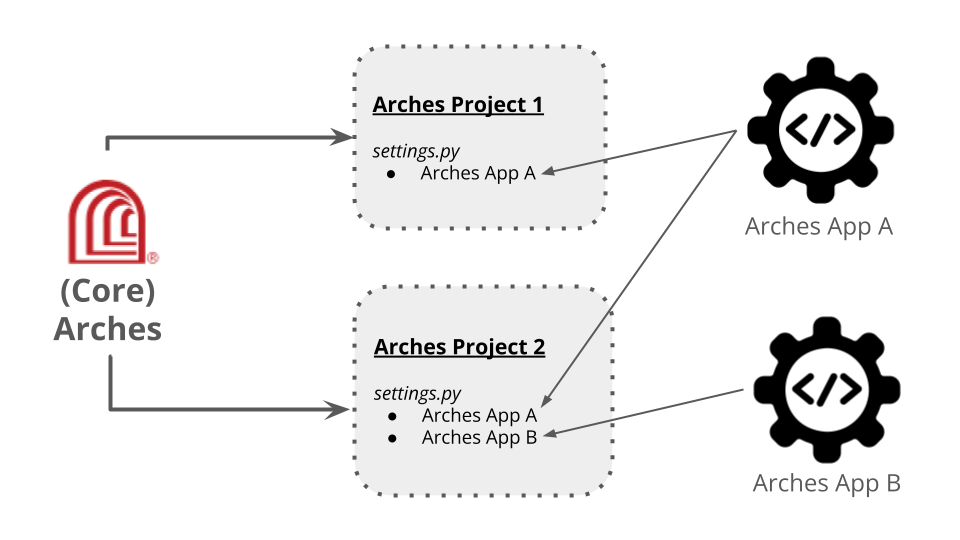

#####################
Creating Applications
#####################

Starting with version 7.5, Arches moved to a new architectural pattern to support certain customization needs. This new pattern called **Arches Applications** (alternatively **Arches Apps**) should make customizations easier to develop and maintain. This architectural pattern also aligns with standard Django practices for the introduction of reusable sets of new features.

What's an App?
==============
The phrase **Arches application** (or **Arches app**) describes a Python package that provides some set of features added to the core (standard) Arches application. Arches apps can be reused in multiple Arches projects. This terminology about *applications* and *projects* purposefully aligns with the `Django definition and use of these terms <https://docs.djangoproject.com/en/4.2/ref/applications/#projects-and-applications>`_.

    Illustration of Arches projects integrating custom Arches Apps.

When are Arches Apps Useful?
============================
Arches Apps provide a means to power special purpose features that may not be appropriate for incorporation into the core (standard) Arches application. A given Arches App can be under version control independent of core Arches. This should make it easier to update and upgrade core Arches independently of a custom Arches App (and vice versa).

A given Arches App can also be developed and shared open source. This means that the custom features powered by an Arches App can be reused widely across the community. Because Arches App development can proceed independently of core Arches, Arches Apps can be an excellent way for community members to experiment with features beyond those listed on the official Arches software development roadmap `official Arches software development roadmap <https://www.archesproject.org/roadmap/>`_.

`Arches for Science <https://www.archesproject.org/arches-for-science/>`_ illustrates the value of Arches apps. Arches for Science has several workflows and features (together with additional software dependencies) useful for cultural heritage conservation science. However, these features would be unnecessary for many other core Arches use cases. Keeping these conservation science features in a distinct app allows `Arches for Science software development <https://github.com/archesproject/arches-for-science/>`_ to continue at its own pace, and it reduces pressures to add highly specialized features to core Arches. Arches apps can therefore help reduce the complexity and maintenance costs of core Arches.

Arches Apps Can Help Avoid Forks
--------------------------------
Through Arches apps, desired special features can be added to an Arches instance without forking the core (standard) Arches application code. There are many advantages to avoiding forks of the core (standard) Arches application code. By avoiding forks, one can more easily take advantage of continued upgrades and security patches applied to core Arches. This makes your use of Arches easier to maintain and secure.

A given Arches App can also be developed and shared open source. This means that the custom features powered by an Arches App can be reused across the community in multiple Arches projects.

Getting Started with Arches Apps
================================
The Arches team created a simple example Arches app to illustrate how to develop and deploy custom apps. The example app called **Arches Dashboard** displays a summary count of resource instances and tiles in a given Arches project.

The **Arches Dashboard** app provides an example of how to build a custom Arches application. Experience with Django in general, and `Django app development <https://docs.djangoproject.com/en/4.2/ref/applications/#>`_ in particular, would be very useful for Arches app development. The official Django documentation provides a great starting `tutorial for learning how to create apps <https://docs.djangoproject.com/en/4.2/intro/tutorial01/#creating-the-polls-app>`_.

Installing the **Arches Dashboard** App
---------------------------------------
You can add the dashboard to an Arches project in just a few easy steps.

1. Install if from this repo (or clone this repo and pip install it locally).

    .. code-block:: shell

        pip install git+https://github.com/chiatt/dashboard.git

2. Add 'dashboard' as to the ARCHES_APPLICATIONS and INSTALLED_APPS settings in the demo project's settings.py file

    .. code-block:: python

        ARCHES_APPLICATIONS = ("dashboard",)  # be sure to add the trailing comma!

3. Add routing to your project to handle the Arches application. This can be either subdomain routing or path-based routing.

   - for subdomain routing:

     - Update your hosts.py file in your project:

       .. code-block:: python

          host_patterns = patterns('',
            host(re.sub(r'_', r'-', r'dashboard'), 'dashboard.urls', name='dashboard'),
            host(re.sub(r'_', r'-', r'demo'), 'demo.urls', name='demo'),
          )
        

   - for path-based routing:

     - Update your urls.py file in your project. You'll likely need to add the `re_path` import:

         .. code-block:: python

             from django.urls import include, path, re_path

         and then the following path:

         .. code-block:: python

             re_path(r"^", include("dashboard.urls")),

4. From your project run migrate to add the model included in the app:

    .. code-block:: shell

        python manage.py migrate

5. Next be sure to rebuild your project's frontend to include the plugin:

    .. code-block:: shell

        npm run build_development

6. When you're done you should see the Dashboard plugin added to you main navigation bar:

    .. figure:: ../../images/dev/demo-arches-app-dashboard-screenshot.png
        :width: 100%
        :align: center

        A screenshot of the functioning **Arches Dashboard** app.
