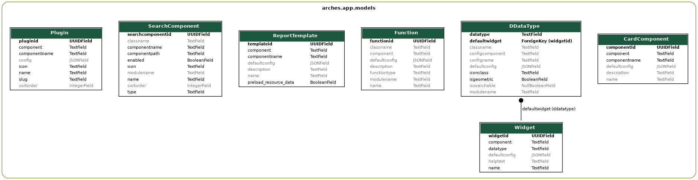

#######################
Creating Extensions
#######################

There are a number of patterns in place to allow you to extend Arches. Extensions can be used to customize the data entry process, add custom display widgets to reports, or even define new types of data that Arches can store.

Types of Extensions
===================

.. toctree::
    :glob:
    :hidden:

    extensions/*

- :doc:`Card Components <extensions/card-components>`
    - Used to create modular data entry and data display units that can be nested arbitrarily in the UI. Creating a custom card component can provide a more complex UI.
    - **Structure**

        .. code-block:: text

            my_project/cards/my-card.json                        <-- Registration config
            my_project/media/js/views/components/cards/my-card.js       <-- UI component
            my_project/templates/views/components/cards/my-card.htm     <-- UI component
- :doc:`Datatypes <extensions/datatypes>`
    - Allows you to store new types of data in Arches, and attach custom logic (like save operations or storage techniques) to that datatype.
    - **Structure**

        .. code-block:: text

            my_project/dataypes/my_datatype.py   <-- Main logic (and registration config)
            my_project/media/js/views/dataypes/my-datatype.js            <-- UI component
            my_project/templates/views/dataypes/widgets/my-datatype.htm  <-- UI component
- :doc:`Functions <extensions/functions>`
    - Can be triggered whenever a tile is saved, providing a framework for the introduction of Python code into day-to-day operations.
    - **Structure**

        .. code-block:: text

            my_project/functions/my_function.py     <-- Main logic (and registration config)
            my_project/media/js/views/functions/my-function.js              <-- UI component
            my_project/templates/views/functions/widgets/my-function.htm    <-- UI component
- :doc:`Plugins <extensions/plugins>`
    - Provides a generic framework for adding new web pages to your project.
    - **Structure**

        .. code-block:: text

            my_project/plugins/my-plugin.json                    <-- Registration config
            my_project/media/js/views/components/plugins/my-plugin.js   <-- UI component
            my_project/templates/views/components/plugins/my-plugin.htm <-- UI component
- :doc:`Resource Reports <extensions/resource-reports>`
    - Can be customized to augment the way a resource instance is presented to the site users and the public.
    - **Structure**

        .. code-block:: text

            my_project/reports/my-report.json                                <-- Registration config
            my_project/media/js/views/components/report-templates/my-report.js      <-- UI component
            my_project/templates/views/components/report-templates/my-report.htm    <-- UI component
- :doc:`Search Filters <extensions/search-filters>`
    - Use these to add extra search capabilities to the interface, or to inject extra filters behind the scenes.
    - **Structure**

        .. code-block:: text

            my_project/search/my_filter.py      <-- Main logic (and registration config)
            my_project/media/js/views/components/search/my-filter.js    <-- UI component
            my_project/templates/views/components/search/my-filter.htm  <-- UI component
- :doc:`Widgets <extensions/widgets>`
    - Widgets allow you to customize how data entered into Arches, and how that data is presented to the public.
    - **Structure**

        .. code-block:: text

            my_project/widgets/my-widget.json                    <-- Registration config
            my_project/media/js/views/components/widgets/my-widget.js   <-- UI component
            my_project/templates/views/components/widgets/my-widget.htm <-- UI component
- :doc:`Workflows <extensions/workflows>`
    - Workflows are a special type of Plugin that allow you to abstract the data entry process away from the default graph tree interface into a step-through set of pages.
    - **Basic Structure**

        .. code-block:: text

            my_project/plugins/my-workflow.json                           <-- Registration config
            my_project/media/js/views/components/plugins/my-workflow.js     <-- Main UI component
            my_project/templates/views/components/plugins/my-workflow.htm   <-- Main UI component
    - **Custom Step Components**

        .. code-block:: text

            my_project/media/js/views/components/workflows/my-workflow-component.js     <-- Step component
            my_project/templates/views/components/workflows/my-workflow-component.htm   <-- Step component

Extension Architecture
======================

Though there is some variation across extension types, Arches does use a common architecture pattern to construct extensions. Generally speaking, the user interface for the extension exists in a new **component** (JS/HTML), and any backend code (if applicable) will be in a **module** (Python). Initial configuration details will be stored in **json**, either in a standalone file or at the top of a module.

A component
-----------

All extensions are expected to have some sort of user interface, and this is created with a pair of files: one HTML template (``.htm``) and one JavaScript file (``.js``). Components are constructed with `KnockoutJS <https://knockoutjs.com>`_.

These files must live here (using a widget as an example)::

    my_project/media/js/views/components/widgets/custom-widget.js 
    my_project/templates/views/components/widgets/custom-widget.htm

A JSON configuration file
-------------------------

A ``.json`` file will store a set of initial configuration details about the extension, which are loaded into the database when the extension is registered. `This file is only used during registration.`

These files typically live here::

    my_project/widgets/custom-widget.json

A module
--------

A few extension types, like Functions, are written in Python. For these, a ``.py`` module must be supplied. Instead of a JSON configuration file, initial configs are stored at the beginning of the module in a dictionary named ``details``.

A module's location follows the same pattern as JSON configuration files::

    my_project/datatypes/custom_function.py

Extension Data Models
---------------------

The backend models for each extension type are shown below.

    Each extension type is stored in a database table for its kind. *Workflows* are techinally *Plugins* so there is no separate table for them.

Managing Extensions
===================

Extensions are "registered" and "unregistered" in one of two ways:

    1) Via the CLI
    2) As part of a package load

For CLI commands, see the end of each extension type's documentation, or checkout the :ref:`Command Line Reference` page. Checkout :ref:`Understanding Packages` for more about how and where extensions are stored within packages.

Adding JavaScript Dependencies
==============================

This section will help if you are creating an extension that requires a new JavaScript library to be available to your component.

By default, the only dependency in a new project's ``package.json`` file is Arches itself:

.. code-block:: json

    {
        "name": "my_project",
        "dependencies": {
            "arches": "archesproject/arches#stable/6.0.1"
        }
    }

This means that when you run ``yarn install`` on this file, all dependencies from the corresponding branch of the core Arches repo will be installed (in this example, `package.json from stable/6.0.1 <https://github.com/archesproject/arches/blob/stable/6.0.1/package.json>`_).

**To add a new package**, you just need to run ``yarn add <package name>`` in your project. This will install the new package and update your ``package.json`` file accordingly.

For example, to add `OpenLayers <https://openlayers.org>`_, enter the ``my_project`` directory and run ``yarn add ol``. Your ``package.json`` will now look something like:

.. code-block:: json

    {
        "name": "my_project",
        "dependencies": {
            "arches": "archesproject/arches#stable/6.0.1",
            "ol": "^6.12.0"
        }
    }

If you are developing a project, keep track of which version of Arches you are developing against and make sure it is properly reflected in your ``package.json``.

.. note::

    When you register a new extension there is no way to automaticate the installation of a new JS dependency, so you'll need to manually run ``yarn add`` as described above.
