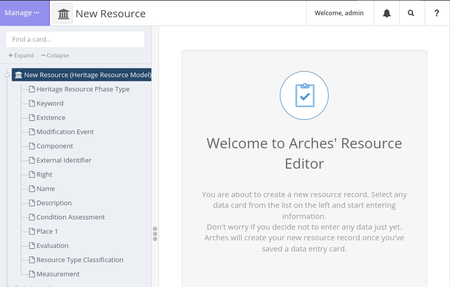
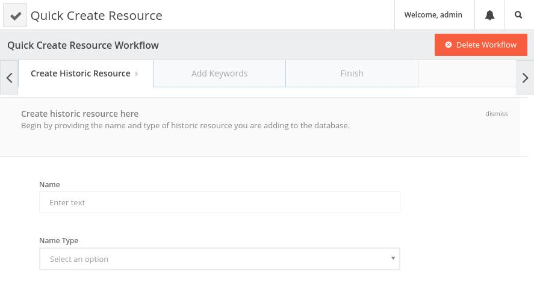

#########
Workflows
#########

Workflows are a type of :doc:`Plugin <plugins>` that can simplify the data entry process. A workflow is composed of one or more cards from a resource model, placing them in a step-through set of forms. This provides users the ability to create new resource instances without having to traverse card-by-card through the resource model tree.

In other words, instead of using this interface to create a new resource:

    Default full resource editor.

...a workflow can pare down the data entry interface to look something like this:

    A simple workflow abstracts data entry away from the card tree into forms.

Workflows can be complex too, facilitating the creation of many different inter-related resource instances simultaneously. We'll use a very simple example here, however, to show how a workflow can be used to extract just a few cards from a large resource model to facilitate a "quick create" task that is easy for users to complete.

Creating a Workflow - the Basics
================================

A very simple workflow will be presented here, based on the `arches-example-pkg <https://github.com/archesproject/arches-example-pkg>`_ resource model called "Heritage Resource Model". This resource model has many cards, but we will make a workflow that pulls out just three of these cards--**Name**/**Name Type**, **Resource Type Classification**, and **Keyword**.

Workflows follow the standard extension pattern: an HTML/JS component and a JSON config. For this example, we have registration configs stored here::

    my_project/plugins/quick-resource-create-workflow.json

and the main UI component looks like this::

    my_project/templates/views/components/plugins/quick-resource-create-workflow.htm
    my_project/media/js/views/components/plugins/quick-resource-create-workflow.js

.. note:: Remember, Workflows are just a special subset of Plugins, so the two types of extensions will be stored alongside each other.

In more advanced workflows, each step will have its own custom component, and these can be stored here::

    my_project/templates/views/components/workflows/first-workflow-step.htm
    my_project/media/js/views/components/workflows/first-workflow-step.js

These custom step components are discussed more :ref:`below <Step Components>`, but our example won't use one.

Registration JSON
=================

Because Workflows are just Plugins, their registration configurations are constructed the same. See :ref:`Registering your Plugin` for more about how to create the JSON file. For our purposes, it will look like this:

.. literalinclude:: ../../../examples/quick-resource-create-workflow.json
    :language: json

Main UI Component
=================

The HTML for this component ``quick-resource-create-workflow.htm`` can be exceptionally simple (just two lines):

.. literalinclude:: ../../../examples/quick-resource-create-workflow.htm
    :language: htmldjango

The workflow's behavior is defined in ``quick-resource-create-workflow.js``. You'll begin with the boilerplate content below. Note that:

- The file name, registered component name, and ``this.componentName`` must all match.
- The ``stepConfig`` attribute will hold the full list of configurations for each step of the workflow.

.. code-block:: javascript

    define([
        'knockout',
        'jquery',
        'arches',
        'viewmodels/workflow',
        // DEFINE EXTRA STEP COMPONENTS HERE AS NEEDED
        'views/components/workflows/final-step'
    ], function(ko, $, arches, Workflow) {
        return ko.components.register('quick-resource-create-workflow', {
            viewModel: function(params) {
                this.componentName = 'quick-resource-create-workflow';
                this.quitUrl = "/search";
                this.stepConfig = [
                    // ADD STEP CONFIG ITEMS HERE
                ];
                Workflow.apply(this, [params]);
            },
            template: { require: 'text!templates/views/components/plugins/quick-resource-create-workflow.htm' }
        });
    });

Workflow Step Configs
---------------------

Now let's look at what one of these ``stepConfig`` items should look like. At minimum, it will have the following properties:

:title:
        This will appear in the tab for the step.
:name:
        An interal id for this workflow step that may be referenced by later steps, for example ``'initial-step'``. *This value must be unique across all other steps in the workflow.*
:required:
        Use ``true`` for ``false`` to determine whether this step must be completed by the user before moving on to the next one.
:workflowstepclass:
        The class for this step. (*Need more info here*)
:informationboxdata:
        The information box gives users guidance on how to complete the workflow step, and must consist of ``heading`` and ``text`` elements (see example below).
:layoutSections:
        A list of the sections that appear within this step. These items will be covered in more detail next.

Put together, a stepConfig will look something like this:

.. code-block:: javascript

    {
        title: 'Create Historic Resource',
        name: 'set-basic-info',
        required: true,
        workflowstepclass: 'create-project-project-name-step',
        informationboxdata: {
            heading: 'Create historic resource here',
            text: 'Begin by providing the name and type of historic resource you are adding to the database.',
        },
        layoutSections: [
            // ADD LAYOUT SECTIONS HERE
        ]
    }

Other properties may be present in a step config if they are needed for more complex workflows.

Layout Sections and Component Configs
-------------------------------------

A workflow step can have one or more ``layoutSections``, each of which contains a list of ``componentConfigs``. Component configs are where we reference the part of the resource model that we want users to access. Simple workflows like our example can use multiple component configs that point to different nodegroups, but more complex steps will typically have only one layout section with one component config, the latter ultimately pointing to a custom :ref:`step component <Step Components>`.

.. code-block:: javascript

    layoutSections: [
        {
            componentConfigs: [
                // INSERT COMPONENT CONFIGS HERE
            ],
        }
    ]

The properties of a component config are as follows:

:componentName:
    The id of the UI component that will be used to render this piece of the step. This can be ``'default-card'`` to use Arches' default display. However, you can also write workflow-specific :ref:`step components <Step Components>` to handle more complex behavior, and this is where you would reference them. (Any custom step components used here must be added to the ``define`` list at the top of the file.)
:uniqueInstanceName:
    An id by which this component can be referenced. *This value must be unique across all other component configs in the step.*
:tilesManaged:
    This must be ``'none'``, ``'one'``, or ``'multi'``, and it determines how many new tiles will be created with this component. Even if the card has a cardinality > 1 in the resource model, setting ``'one'`` here will still disallow multiple values from being created.
:parameters:
    These parameters will be passed to the component. Typically, in the first step you will only use ``graphid`` (for the resource model) and ``nodegroupid`` (to determine which nodegroup/card to show). Later steps will also need to be passed the ``resourceid`` which is pulled from the first step. *Keep in mind that custom step components may require extra parameters.*

.. code-block:: javascript

     {
        componentName: 'default-card',
        uniqueInstanceName: 'resource-name', /* unique to step */
        tilesManaged: 'one',
        parameters: {
            graphid: '99417385-b8fa-11e6-84a5-026d961c88e6',
            nodegroupid: '574b58a3-e747-11e6-84a6-026d961c88e6',
        }
    }

In this example, ``graphid`` refers to the UUID for the Heritage Resource Model, and ``nodegroupid`` is the UUID for the nodegroup that holds the Name and Name Type nodes.

.. note::
    There are a couple of ways to find the ``nodegroupid``.

    1. In the Arches web UI, open the graph designer for the resource model and use your browser's dev tools to isolate the element for the nodegroup you want. The UUID will be visible in the HTML.
    2. Using the Django shell::

        python manage.py shell

        >>> from arches.app.models.models import Node
        >>> Node.objects.get(name="Name", graph__name="Heritage Resource Model").pk

In the second step of our example workflow, where the user will enter a keyword for the new resource, we'll need to pass an extra parameter ``resourceid`` that was created in the first step. Doing so looks like this:

.. code-block:: javascript

    parameters: {
        graphid: '99417385-b8fa-11e6-84a5-026d961c88e6',
        nodegroupid: '3d919f0d-e747-11e6-84a6-026d961c88e6', // UUID for the Keyword nodegroup
        resourceid: "['set-basic-info']['resource-name'][0]['resourceInstanceId']",
    }

To break this ``resourceid`` entry down:

    - ``'set-basic-info'`` is the **name** of the step from which we are pulling the id (see our first step above)
    - ``'resource-name'`` is the **uniqueInstanceName** of the component config in which the tile was created
    - ``0`` is the first tile object
    - ``'resourceInstanceId'`` is the property of the tile that we are looking for

Patterns like this can be used elsewhere within workflows to pass information from step to step.

The Final Step
--------------

The final step of our example workflow looks like this:

.. code-block:: javascript

    {
        title: 'Finish',
        name: 'add-resource-complete',  /* unique to workflow */
        description: 'Finish the resource creation.',
        layoutSections: [
            {
                componentConfigs: [
                    {
                        componentName: 'final-step',
                        uniqueInstanceName: 'create-resource-final',
                        tilesManaged: 'none',
                        parameters: {
                            resourceid: "['set-basic-info']['resource-name'][0]['resourceInstanceId']",
                        },
                    },
                ],
            },
        ],
    }

As you can see, no tiles are created here, and we are using the default ``'final-step'`` component that Arches provides (you'll note this component is defined at the top of the file). This step will contain a save/cancel prompt.

Workflows often contain more elaborate final steps than the default one presented here, for example you may want to list all of the data that has been entered throughout the workflow so the user can review it before saving. This behavior is not available by default, but here is an example of a final step with that capability:

- `Step config <https://github.com/archesproject/arches-her/blob/master/arches_her/media/js/views/components/plugins/consultation-workflow.js#L169>`_
- `Step component JS <https://github.com/archesproject/arches-her/blob/master/arches_her/media/js/views/components/workflows/consultation/consultations-final-step.js>`_
- `Step component HTML <https://github.com/archesproject/arches-her/blob/master/arches_her/templates/views/components/workflows/consultation/consultations-final-step.htm>`_

As you can see, the component gathers all data for the resource and markdown simply hard-codes the presenation of each individual node.

Full Example Workflow
---------------------

Putting it all together, our main workflow component looks like this:

.. literalinclude:: ../../../examples/quick-resource-create-workflow.js
    :language: javascript

Step Components
===============

You may want to create custom components for your workflow steps to handle more complex data entry tasks. These should be stored in a ``workflow`` directory, or grouped into subdirectories thematically. A step component can be used by any workflow, as long as it is passed the correct parameters.

.. important::
    If you are loading a package with a workflow in it, you will need to manually copy step component files into your project--they are not handled by the package load process.

Here are some examples of workflows that use custom step components you can look at when beginning to construct your own:

- `Arches HER Workflows <https://github.com/archesproject/arches-her/tree/master/arches_her/media/js/views/components/plugins>`_
    - All files here define workflows besides the one called ``init-workflow.js`` (which is a standard plugin)
    - In one of these workflows, find a ``componentName`` that is *not* ``'default-card'``
    - Now, look for that component name in the following two places:
        - `Arches HER Step Components (JS) <https://github.com/archesproject/arches-her/tree/master/arches_her/media/js/views/components/workflows>`_
        - `Arches HER Step Components (HMTL) <https://github.com/archesproject/arches-her/tree/master/arches_her/templates/views/components/workflows>`_

Registering your Workflow
=========================

After placing your workflow files in the proper directories within your project, you are ready to register it. See :ref:`Plugin Commands` for more information.

Accessing the Workflow
======================

If the Workflow (or any other Plugin) is registered but is not visible, an administrator must grant access to it via the Django admin panel on a per-user or per-group basis.

Navigate to ``localhost:8000/admin`` and login, and locate profiles for the user(s) or group(s) that should be able to access the Workflow. Find the "User/Group permissions" section, scroll to your workflow, and add the "view" privilege. Click "SAVE" to finish.
