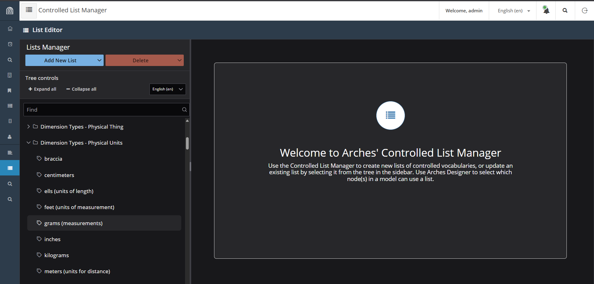
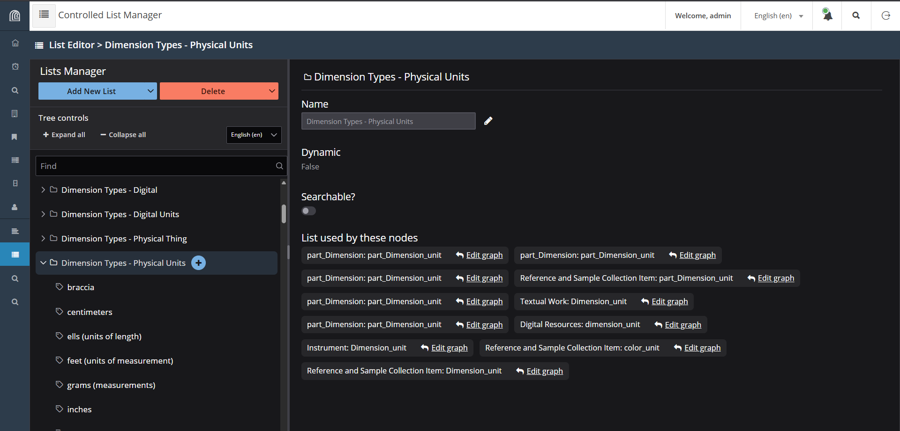

=============================
Arches Controlled Lists (App)
=============================

**Arches Controlled Lists** is an Arches modular application designed to manage controlled lists and reference data within the Arches platform. It is meant to update, improve upon, and replace the functionality of the :ref:`Reference Data Manager (RDM)`. Arches Controlled Lists can be installed as a component of an Arches instance that runs on core Arches version 8 and higher.

Arches Controlled Lists Uses
----------------------------

* Arches Controlled Lists provides a set of tools for managing controlled lists within the Arches framework for use as dropdowns in forms and other UI components.
* Controlled Lists can be loaded from `Arches Lingo <https://github.com/archesproject/arches-lingo/>`_ data or any other data authority capable of providing SKOS RDF formatted data.
* The Controlled List Manager is included as a UI for creating, editing, and managing controlled lists and their items.
* Data can be repeatedly updated via import in order to keep it current and in sync with the source of truth.
* Controlled Lists can also be created by an end user for managing simple domain lists locally.
* Controlled Lists can be hierarchical allowing for the representation of concept hierarchies or other hierarchical structures.
* Controlled list items support localization and alternate labels, as well as notes and images.
* Controlled list items are identified by a URI, allowing them to be canonically defined in any external system that provides linked data.
* Arches Controlled Lists includes a new data type called the "Reference" data type, which allows for the creation of references to controlled list items within the Arches framework.
* Arches Controlled Lists can also be made "searchable", which allows for searching for references in Arches data based on the hierarchical relationships defined in controlled lists.
* `Arches Lingo <https://github.com/archesproject/arches-lingo/>`_ uses the Controlled List Manager and the Reference data type, for example, to manage references to concepts managed externally such as SKOS concepts.
* Arches Controlled Lists is a key component in enabling the use of `Arches Lingo <https://github.com/archesproject/arches-lingo/>`_ data across projects.  For example, the `FISH Thesauri <https://heritage-standards.org.uk/fish-vocabularies/>`_ can be maintained in one Arches instance and then referenced in any `Arches for HER <https://www.archesproject.org/arches-for-hers/>`_ deployment.

Arches Controlled Lists User Interface (UI)
-------------------------------------------

The Arches Controlled Lists user interface is accessible to authorized users via the menu icons on the far left. List items are organized in a hierarchy of lists. In the example below, the list item for *grams* is contained in the parent *Dimension Types - Physical Units* list.

    Screenshot of the Arches Controlled Lists user interface

If one clicks on a given list, the Arches Controlled Lists user interface displays the nodes that make use of the selected list. See the screenshot below.

    Nodes that use the *Dimension Types - Physical Units* list

**Note**: Additional user interface guidance is forthcoming.

Installing Arches Controlled Lists
----------------------------------

The **Arches Controlled Lists** application needs to be installed in the Python virtual environment of your Arches instance. Once installed, you will need to edit your Arches instance's ``settings.py`` and other files. The complete installation instructions can be found here: `Arches Controlled Lists README <https://github.com/archesproject/arches-controlled-lists?tab=readme-ov-file#installation>`_ 
