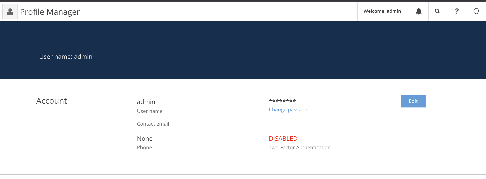
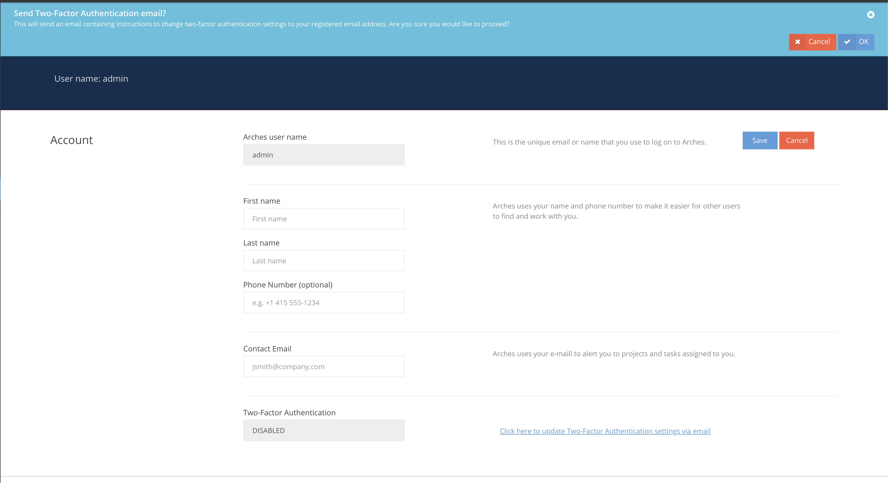
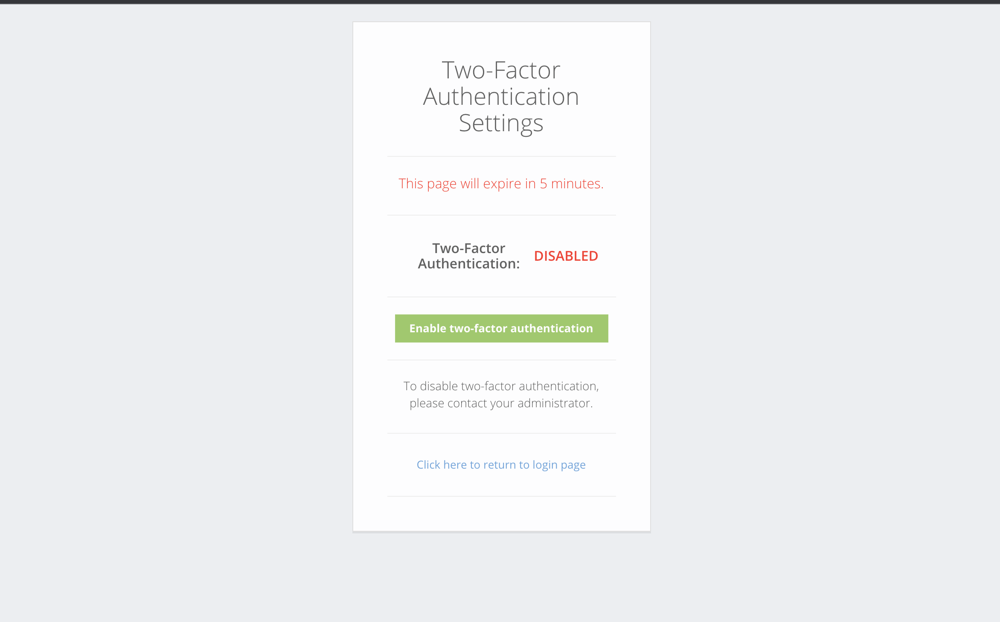
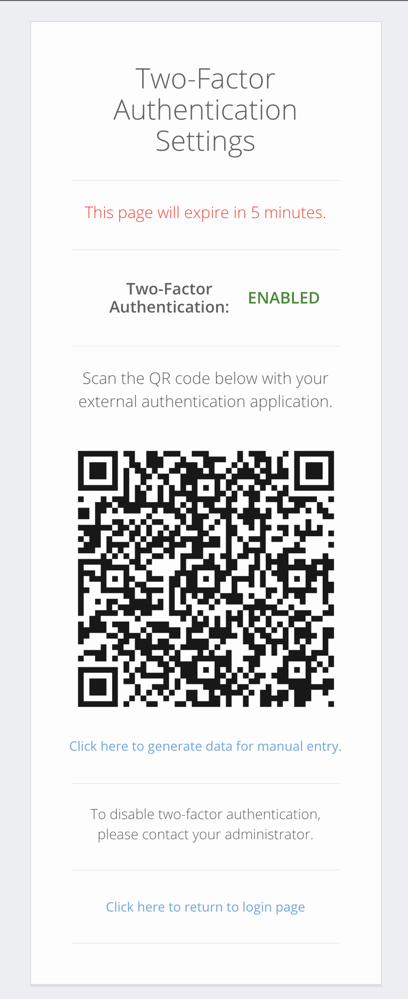
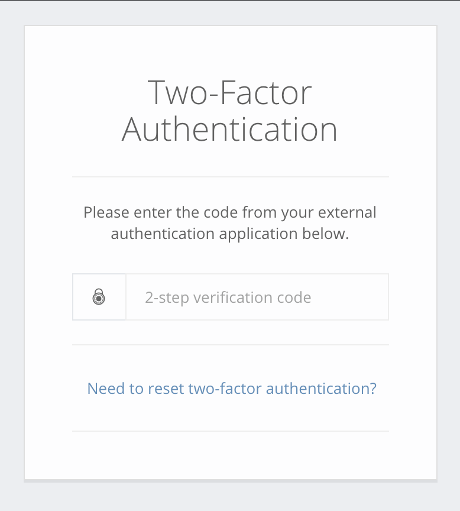

#########################
Two-factor Authentication
#########################

Two-factor authentication is an extra layer of security designed to ensure that you're the only person who can access your Arches account, even if someone knows your password.

* `How Two-factor Authentication Works`_

  *A brief introduction to two-factor authentication theory.*

* `Enabling Two-factor Authentication in Arches`_

  *The specific mechanisms Arches uses for two-factor authentication, and how to enable two-factor authentication for your Arches application.*

* `Setting up Two-factor Authentication for User Accounts`_

  *How to set up two-factor authentication as an Arches user.*

How Two-factor Authentication Works
-----------------------------------
Two-factor Authentication is the technical term for the process of requiring a user to verify their identity in two unique ways before they are granted access to the system. 
Users typically rely on authentication systems that require them to provide a unique identifier such as an email address or username and a correct password to gain access to the system.
Two-factor Authentication extends this by adding an additional step that requires the user to enter a one-time dynamically generated token that has been delivered through a secondary method that presumably only the user has access to.
This token is randomly generated and lasts a brief period of time before changing. It is based on an encrypted secret key that is stored in the application and secondary system ( eg. smartphone ).

Two-factor Authentication gives the user and system administrator a peace of mind that even if the user's password is compromised, 
the account cannot be accessed without also knowing the dynamically generated one-time password.

Enabling Two-factor Authentication in Arches
--------------------------------------------

There are two configurable settings, ``ENABLE_TWO_FACTOR_AUTHENTICATION`` and ``FORCE_TWO_FACTOR_AUTHENTICATION`. Each accepts a value of ``True`` or ``False``.

* ``ENABLE_TWO_FACTOR_AUTHENTICATION`` - Allows users to enable two-factor authentication via their ``UserProfile``, and redirects login of users that have enabled two-factor authentication to secondary credentials page.
* ``FORCE_TWO_FACTOR_AUTHENTICATION`` - Must have ``ENABLE_TWO_FACTOR_AUTHENTICATION`` enabled. Forces all users to log in with two-factor authentication credentials.

.. note::
  ``ENABLE_TWO_FACTOR_AUTHENTICATION`` and ``FORCE_TWO_FACTOR_AUTHENTICATION`` do not trigger any other actions, such as terminating user sessions.

Setting up Two-factor Authentication for User Accounts
------------------------------------------------------

If ``ENABLE_TWO_FACTOR_AUTHENTICATION`` or ``FORCE_TWO_FACTOR_AUTHENTICATION`` have been enabled in your Arches application, users can check the status of their accounts in the User Profile page.

    User Profile showing two-factor authentication status.

From User Profile Edit page, Users can send an email to their registered email address containing instructions and a link to set up two-factor authentication.

    User Profile showing two-factor authentication reset email interaction.

.. note::
  In order to continue, the User should already have access to a means of secondary authentication. 
  This is done with an external application, usually with `Google Authenticator <https://play.google.com/store/apps/details?id=com.google.android.apps.authenticator2>`_,
  `Authy <https://authy.com/>`_, `LastPass Authenticator <https://lastpass.com/auth/>`_, or any other authentication application.

Following the email link, the user will navigate to the two-factor authentication settings page.

    Two-factor authentication settings page.

From this page, Users can generate a QR code to be scanned with an external authentication application, or a secret key to be entered manually. This secret is used to generate time-based authentication tokens.

    Two-factor authentication settings page showing QR code.

Once the user has enabled two-factor authentication, or if ``FORCE_TWO_FACTOR_AUTHENTICATION`` has been enabled at the system level, the user will be presented with an additional step in the login process. Once the six-digit authentication code has been entered, the User will be logged in.

    Two-factor authentication login page.
