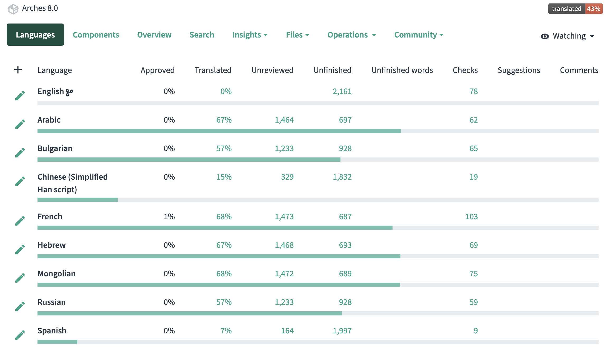
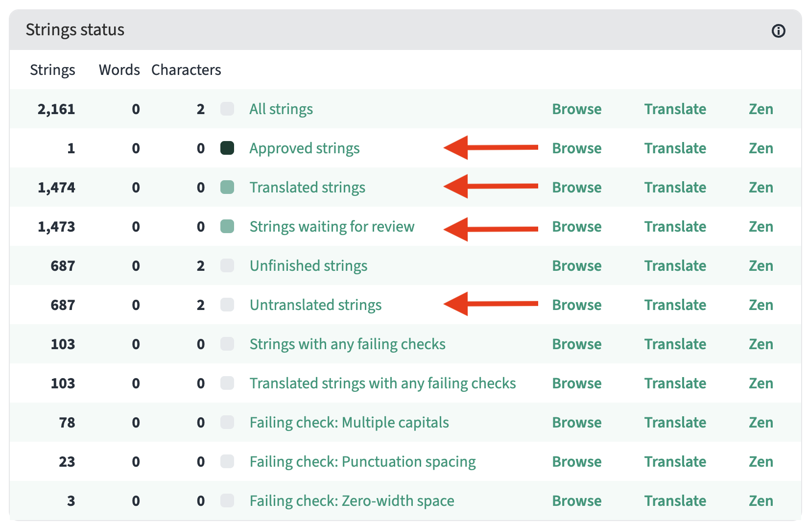
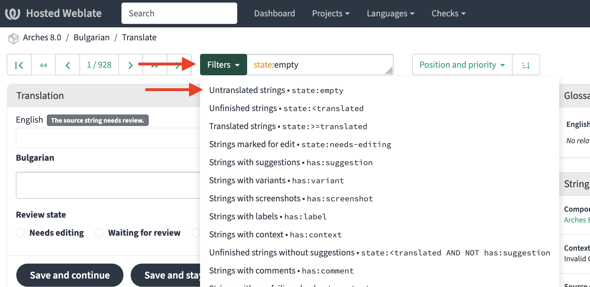
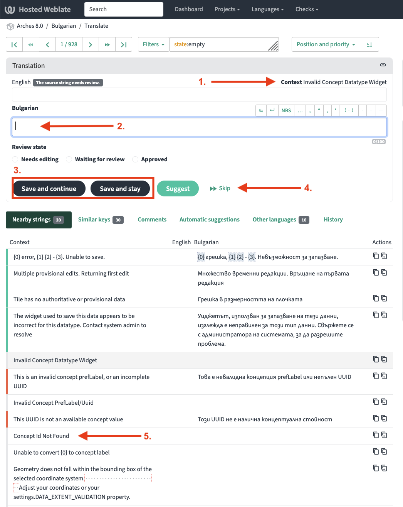
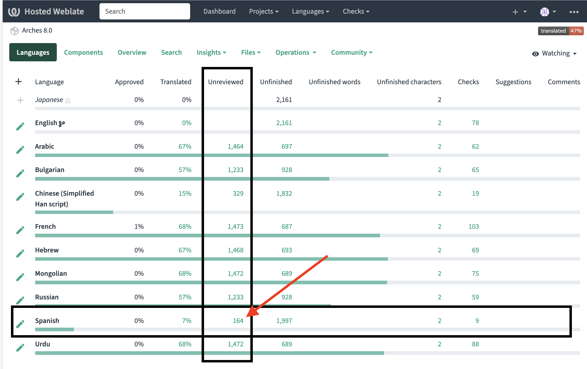
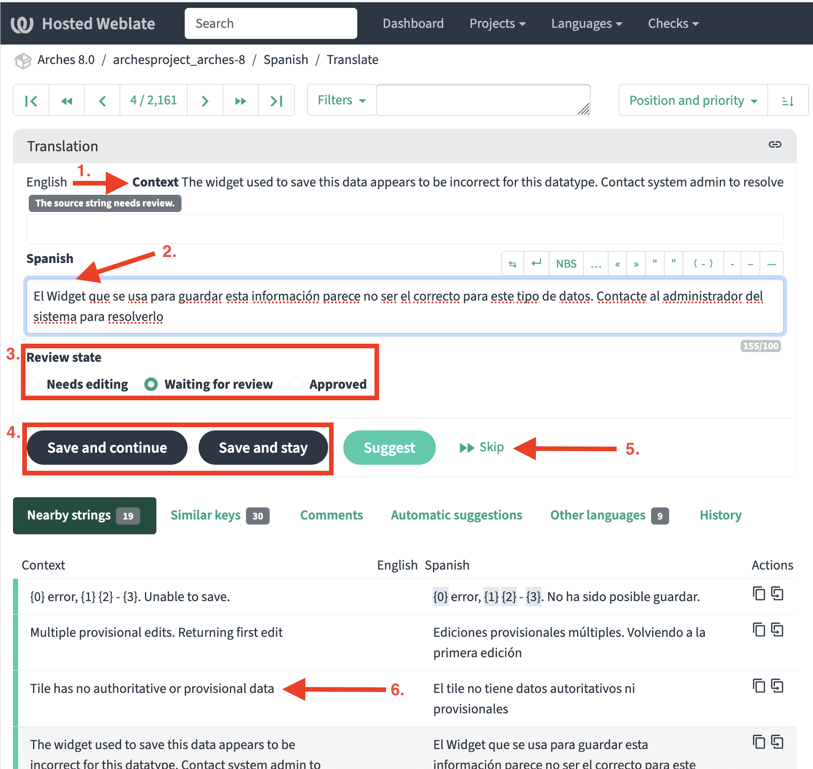
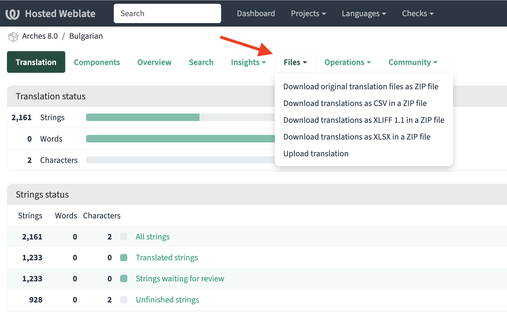

#####################
Creating Translations
#####################

Introduction
------------
Arches supports localization since v7, thanks to a contribution from the Arcadia Fund.  This enables translations of the Arches UI from English to other languages, along with the ability to contribute those transitions back to the Arches code as an asset for the community.

The Arches Project has adopted `Weblate <https://weblate.org/>`_, an open source platform, as a translation tool.  It offers an easy to use interface for anyone in the community to translate Arches UI text. Arches v7 and v8 are currently set up as projects in Weblate, with several translations underway.

If you would like to translate into a language not already undertaken, create a post on the `Arches Project Forum <https://www.archesproject.org/forum/>`_ that requests an additional language be added to the project.

If you are interested in translating another Arches application, such as Lingo or Arches for Science, create a post on the `Arches Project Forum <https://www.archesproject.org/forum/>`_ that requests a new project be created. 	

Making these requests as Forum posts provides visibility for the community of activity around Arches translations. It can also help align work, as others in the community may have begun translations into languages that we are not aware of. Administrators of the Arches Project Weblate account are guaranteed to see all Forum posts.

This page is a guide to using Weblate as a tool to translate Arches strings from English into other languages. For information on how to implement translations into your deployment of Arches, read about :ref:`Localization` in the Arches documentation.

Overview
--------
Weblate assists with translations of Arches UI text strings from English into other languages with the following workflow:

+ **Translate**: Individual text strings can be translated from English into a given language
+ **Review**: Existing translations can be reviewed and approved
+ **Share**: The translated files can be downloaded from Weblate for your instance of Arches, or submit a PR to the `Arches repository in GitHub <https://github.com/archesproject/arches>`_ to contribute a translation file back to the code

Translations can be used even if they are not reviewed and approved. The review workflow is an opportunity to validate the accuracy of translations by another individual.

Getting Started
---------------
To get started, sign into Weblate or Create an Account: `https://hosted.weblate.org/accounts/login/?next=/hosting/ <https://hosted.weblate.org/accounts/login/?next=/hosting/>`_ 

There are several projects under the Arches workspace in Weblate, including Arches v8.  If you don’t already have access, send a request to `contact@archesproject.org <contact@archesproject.org>`_ for an invitation to create a user account in Weblate.  This will give you access to the UI that allows you to effectively translate or review other translated content for Arches.  

Orientation
-----------

1. Search for the project name (eg., "Arches 8.0") and select the project.

2. Defaults to the "Languages" tab, which shows you the translation status of that project in languages for which a translation has been started already.

    a. If the language you are translating is not on the list, `create a post on the Arches Project Forum <https://community.archesproject.org/tag/translation/17%C2%A0>`_ to request a new language

    The project dashboard shows the status of each language's translation of total text strings within the project. 

    If you click on any language, you'll see a more detailed breakdown for that language in a dashboard. The image above illustrates the detailed status information for a language.

Areas to note
=============

+ Approved strings - this is the number of strings that have been both translated and reviewed for the project in the chosen language

+ Translated strings - this is the total number of strings that have been translated for the project in the chosen language, regardless of review and approval status

+ Strings waiting for review - this is the number of translated strings for the project in the chosen language that have not yet been reviewed and approved

+ Untranslated strings - this is the number of strings available for the project that have not yet been translated into the chosen language

Clicking on any of these labels will take you to the related content, bringing you to an interface that displays any strings that fall under that status.

How to Translate
----------------

In order to translate, you must first create an account in Weblate, and project administrators must designate you as a user with Translate permissions.

Navigate to the **Project > Language** as described above to access the translation dashboard for a specific language.  Clicking on "Untranslated strings," or on the "Translate" option to the right, will take you to the UI for translating in the chosen language.

Use the “Filters” drop down to select “Untranslated strings.”

    Example use of Weblate "Filters" (drop down features) to select "Untranslated strings."

Translation UI
==============

    To begin translating text strings, you should be familiar with a few components of the translation UI.

1. Context:  This shows you the text in English of the string that is currently loaded for translation.

2. Input Field:  The cursor should default to the input field.  This is where you will type your translation in the intended language (in the example, Bulgarian).

3. Save Options:  Once you begin or complete a string translation, use these options to either save and automatically advance to the next untranslated string or to save and remain on the current string.

4. Skip:  Allows you to advance to the next untranslated string whether or not you have input or saved any translation for the current string.

5. The lower UI will show nearby strings by default.  If you click directly on any one, you will navigate to that string and it will be loaded into the translation interface above. 

As long as you have saved after translating individual strings, you can navigate out at any time.

How to Review
=============

To begin reviewing translated text strings, you should be familiar with a few components of the review UI. Weblate provides a review workflow, so that in addition to creating translations of text strings, community members can also review and approve those translations.  

    Interface example of un-reviewed strings

To begin reviewing and approving text strings, you should be familiar with a few components of the review UI.

    Example of the Review User-Interface

1. Context: This shows you the text in English of the string that is currently loaded for review or editing.

2. Input Field: This will display the translated string in the chosen language (in the example, Spanish).

3. Review State: This will default to "Waiting for Review," but the reviewer can select "Needs Editing" or "Approved" upon completion of their review.

4. Save Options: Once you begin or complete review of a string, use these options to either save and automatically advance to the next untranslated string or to save and remain on the current string.

5. Skip:  Allows you to advance to the next un-reviewed string whether or not you have reviewed or saved the current string.

6. The lower UI will show nearby strings by default. If you click directly on any one, you will navigate to that string and it will be loaded into the review interface above. 

How to Contribute Translations to Arches
----------------------------------------

Translation files can be downloaded from Weblate and manually implemented into your local version of Arches. However, the localization feature in Arches allows for those files to be contributed back to the code itself, offering multiple language options in an updated instance of Arches.

Translations are not automatically integrated back into the Arches code. Create a pull request in GitHub to contribute a translation (or partial-translation) `.po` file to the Arches repository. To download translated files directly from Weblate, navigate to the relevant project, select the chosen language, and utilize the "Files" menu drop down to select a format and download.

    Example of the "Files" menu to download and upload translation files