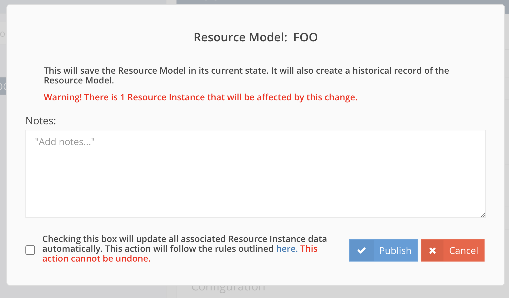

##################
Automatically Updating Resources
##################

Arches provides user interface features to update resource instances when the corresponding Graph changes. 

Automatically update resource instances
--------------------------------------------
When publishing a new Graph, you are given the option to update the associated resource instances accordingly. This is a generic process that follows a specifc set of rules. It's good for handling minor changes, but for more complex changes you will likely want to write a business data migration.

The set of rules for this process is:

- Changes made to a `Node`, `Card`, or `Widget` will change tile data as expected.
- If you are updating the cardinality of a `Nodegroup` from `n` to `1`, the first `Tile` is preserved, the others are deleted.
- The `ResourceInstance`'s `graph_publication_id` will be updated to the current `GraphXPublishedGraph` id. 

The picture below illustrates the interaction for automatically updating resource instances:

